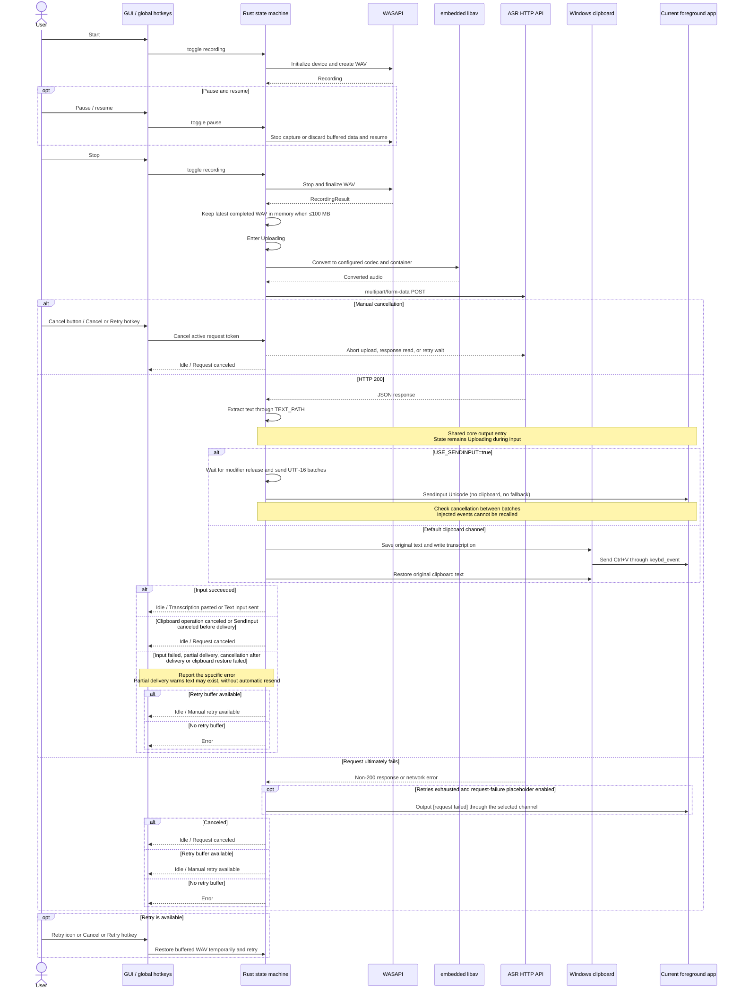
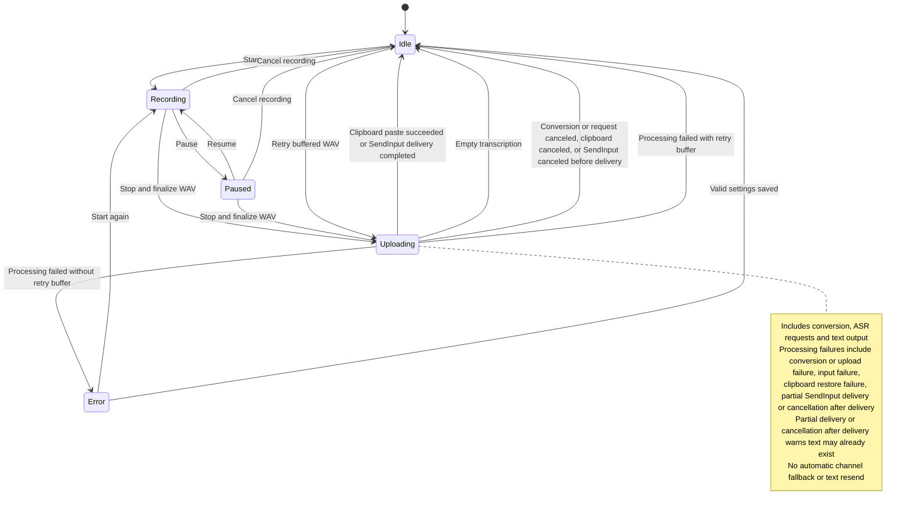

English | [简体中文](README_ZH.md)

# STT for Windows

STT for Windows is a local speech-to-text client for Windows x86_64. It records microphone audio through global hotkeys or a native floating window, sends the completed audio file to a compatible ASR HTTP endpoint, extracts the transcription, and automatically pastes it at the current input position.

The project provides two Rust programs:

- `STT.exe`: a native Win32 GUI using Windows WASAPI capture and a statically linked, trimmed FFmpeg/libav build, ready to run after extraction.
- `stt.exe`: a command-line program that supports hotkey-controlled recording and transcription of existing audio files, using the same embedded libav converter as the GUI; no system FFmpeg is required.

The current implementation is built with Rust, Win32, Direct2D, and DirectWrite.

## Features

- **Native Windows GUI**
  - Borderless, always-on-top floating window with per-monitor DPI support.
  - Consistent antialiased, self-drawn rounded corners for the floating and settings windows on Windows 10 and Windows 11, without a native outer border or second corner layer.
  - Full mode, minimal toolbar, system tray integration, taskbar visibility control, and a native settings window.
  - Configurable opacity and `0.3`–`2.0` scale shared by the full and minimal floating-window modes.
  - Interface languages: English, Simplified Chinese, German, Japanese, and French.
- **Global hotkey recording**
  - Start or stop recording, pause or resume recording, and cancel a recording or an in-flight transcription request.
  - When idle with a retryable recording, the Cancel or Retry hotkey resubmits that recording.
  - Uses a low-level keyboard hook by default, with `RegisterHotKey` available as an alternative.
- **General-purpose ASR HTTP interface**
  - Uploads audio through `multipart/form-data` with a fixed file field named `file`.
  - Supports Bearer tokens, model, language, prompt, and custom form fields.
  - Supports request timeouts, exponential-backoff retries, HTTP/2, and TLS certificate verification.
- **Cancelable processing pipeline**
  - Recording, embedded FFmpeg conversion, HTTP upload, response reading, retry waits, and clipboard waits are all cancellation-aware.
  - While uploading, the GUI keeps its cancel button available and both programs keep the Cancel or Retry hotkey available.
- **Recording retry**
  - GUI and CLI hotkey mode retain only the latest completed recording in process memory, capped at 100,000,000 bytes; the buffer is released when the application exits.
  - The GUI reuses the cancel-button slot for retry, while both programs reuse the Cancel or Retry hotkey whenever they are idle with a retryable recording.
- **Automatic extraction and paste**
  - Uses `TEXT_PATH` to read text from JSON responses, including nested objects and repeated array indexes.
  - Saves the original clipboard text, sends `Ctrl+V`, and then attempts to restore it.
- **Shared embedded audio processing**
  - GUI and CLI share microphone discovery, stable endpoint selection, and device-format capture in `stt-core`.
  - Both programs statically link libav and never search for or launch an external FFmpeg executable.
  - Optional Earshot VAD detects speech on a 16 kHz mono branch and trims the original audio.
- **Caching and diagnostics**
  - Optionally retains the original WAV, converted audio, and successful response.
  - Provides debug output for recording, conversion, hotkeys, and uploads.

## Downloads

| Component | Download | SHA-256 |
|---|---|---|
| GUI | [stt-gui-windows-amd64.zip](https://github.com/Joey-Kot/STT-for-Windows/releases/download/Latest/stt-gui-windows-amd64.zip) | [sha256](https://github.com/Joey-Kot/STT-for-Windows/releases/download/Latest/stt-gui-windows-amd64.zip.sha256) |
| CLI | [stt-cli-windows-amd64.zip](https://github.com/Joey-Kot/STT-for-Windows/releases/download/Latest/stt-cli-windows-amd64.zip) | [sha256](https://github.com/Joey-Kot/STT-for-Windows/releases/download/Latest/stt-cli-windows-amd64.zip.sha256) |

### Which version should I use?

| Use case | Recommended version |
|---|---|
| Daily desktop use with floating-window configuration and controls | `STT.exe` GUI |
| Automation, scripts, or terminal-based hotkey recording | `stt.exe` CLI |
| Transcribing an existing audio file to a text file | `stt.exe` CLI |
| No FFmpeg installation desired | GUI or CLI |

## Architecture

`stt-core` handles configuration, microphone discovery and selection, capture-format negotiation, recording, the runtime state machine, ASR requests, caching, hotkeys, and clipboard operations. GUI and CLI share these implementations.

```mermaid
flowchart LR
    subgraph Entry["Control entry points"]
        GUI["STT.exe<br/>Win32 GUI"]
        CLI["stt.exe<br/>Hotkey mode"]
        FileMode["stt.exe --file<br/>File mode"]
    end

    GUI --> Runtime["stt-core<br/>Runtime state machine"]
    CLI --> Runtime
    FileMode --> FilePipeline["File transcription pipeline"]

    Runtime --> Recorder["WASAPI<br/>Selected microphone / system default"]
    Recorder --> WAV["WAV preserving capture rate, channels and precision"]

    WAV --> Convert["Recording conversion abstraction"]
    WAV --> RetryBuffer["GUI and CLI retry buffer<br/>latest completed WAV, memory only, ≤100 MB"]
    RetryBuffer -->|Retry| Convert
    Convert --> LibAv["Shared embedded libav + optional Earshot VAD"]
    FilePipeline --> LibAv

    LibAv --> Request["ASR multipart request"]
    Request --> Extract["JSON + TEXT_PATH"]

    Extract -->|Hotkey/GUI mode| Channel{USE_SENDINPUT}
    Channel -->|false, default| Clipboard["CF_UNICODETEXT<br/>Ctrl+V + restore"]
    Channel -->|true| Unicode["SendInput Unicode<br/>No clipboard or fallback"]
    Clipboard --> App["Current foreground app"]
    Unicode --> App
    Extract -->|File mode| TextFile["Text file"]
```



The GUI and CLI share the same configuration format and ASR request semantics. Their main differences are the interface, configuration file location.

## Recording and transcription flow



The application does not stream audio while recording. Conversion and the ASR request begin only after recording has stopped and the WAV file has been finalized. If the completed WAV is larger than 100,000,000 bytes, the request still proceeds normally but GUI and CLI hotkey mode do not retain it for retry; a terminal processing failure then enters `Error`.

## Runtime state machine



Normal actions use a non-queuing action lock. Repeated start, stop, or pause actions received while busy are dropped instead of being queued for later execution. Cancellation in the `Uploading` state is the exception: it bypasses the action lock and directly cancels the active request token.

The retry buffer is replaced only when a new recording is completed. Canceling while recording leaves the previous buffered recording untouched; canceling while uploading retains the recording whose request was canceled. A retry keeps its own buffered recording after either success or failure.

## Capabilities and current limitations

- Current releases provide Windows x86_64 builds only.
- The GUI is a native Windows-only application. The CLI source can be compiled on other systems, but global Windows hotkeys are available only on Windows.
- Microphone capture and enumeration require Windows. GUI and CLI support a selected input endpoint or the system default; devices are resolved at each recording start.
- The complete audio file is uploaded after recording; real-time streaming transcription is not supported.
- The ASR endpoint must accept `multipart/form-data` and return JSON.
- Only HTTP 200 is treated as success. Other status codes enter the retry or failure path.
- The HTTP client does not use system proxies, follow redirects automatically, or enable automatic response compression.
- Embedded libav runs on a blocking worker with cancellation callbacks inside decoding and interval processing, plus interruptible file I/O. Cleanup waits for the worker to close the output.
- Automatic paste targets the foreground application when transcription finishes. Changing focus while waiting changes the final paste target.
- The GUI does not provide Windows Toast notifications, tray balloons, or other system notifications.
- `NOTIFICATION` in older configuration files is ignored and is not written back when the configuration is saved.
- `REQUEST_FAILED_NOTIFICATION` is not a system notification switch. It only controls whether `[request failed]` is pasted after all retries are exhausted.

## Requirements

### GUI

- Windows 10 or Windows 11 x86_64.
- A working microphone input device.
- A compatible ASR HTTP endpoint.
- No FFmpeg, PortAudio, WebView2, or Visual C++ Redistributable installation is required.

### CLI

- Windows x86_64.
- A microphone for hotkey recording mode.
- No system FFmpeg installation is required.
- A compatible ASR HTTP endpoint.

### Source development

- Rust 1.97 or newer.
- The Rust `x86_64-pc-windows-gnu` target.
- MinGW-w64, C/C++ build tools, `pkg-config`, Autoconf, Automake, Libtool, NASM, YASM, and XZ tools.
- Network access to obtain FFmpeg and codec sources when building the static audio dependencies.

## GUI usage

### First run

1. Download and extract `stt-gui-windows-amd64.zip`.
2. Run `STT.exe`.
3. The application creates a default configuration at:

```text
%APPDATA%\stt\config.json
```

4. Open settings through the gear button on the floating window or the tray menu.
5. Set at least `API_ENDPOINT`, along with `TOKEN`, `MODEL`, and `TEXT_PATH` as required by the service.
6. Save the settings, then start recording with the floating-window button or the default hotkey.

The interface language is stored separately at:

```text
%APPDATA%\stt\ui-language.txt
```

The interface language is not written to the ASR configuration file and does not change the `LANGUAGE` field sent in requests.

### Floating-window controls

| Control | Available states | Behavior |
|---|---|---|
| Microphone | `Idle`, `Error`, `Recording`, `Paused` | Starts recording, or stops recording and enters the transcription pipeline |
| Pause/play | `Recording`, `Paused` | Pauses or resumes recording |
| Cancel / retry | `Recording`, `Paused`, `Uploading`; `Idle` when retry is available | Cancels the current recording or in-flight transcription request. In `Idle`, the same slot stays a disabled cancel icon when there is no retryable recording; otherwise it shows a retry icon and resubmits the buffered recording |
| Gear | Any state before shutdown | Opens the native settings window |
| `-` / `+` | Any state | Switches between the full floating window and minimal toolbar |
| Top drag handle | Full mode | Moves the floating window |
| Toolbar background or button drag | Minimal mode | Moves the toolbar; exceeding the drag threshold suppresses the button action |

Full mode displays a taskbar tab. Minimal mode hides the taskbar tab while retaining the tray icon. The tray menu contains `Minimal`, `Settings`, and `Quit`; double-clicking the tray icon restores full mode. The Display page's floating-window scale applies immediately after saving and scales both modes, including their rendered content and pointer hit regions.

### Settings window

| Page | Contents |
|---|---|
| Display | Interface language, configuration file location, floating-window opacity, and floating-window scale |
| API | Endpoint, token, model, language, prompt, text path, and extra fields |
| Audio | Microphone (first item), output channels, output sample rate, output sample depth, bitrate, codec, container, VAD, and padding |
| Network | Timeout, retries, HTTP/2, and TLS verification |
| Hotkeys | Three hotkeys, low-level hook, clipboard wait intervals, and Use SendInput |
| Cache | Cache directory, cache retention, and request-failure placeholder text |
| Debug | FFmpeg, recording, hotkey, and upload diagnostics |
| About | Project, author, license, and repository information |

Settings can be saved only in the `Idle` or `Error` state. When settings are saved, the application validates the configuration, rebuilds the ASR client and recorder, and registers the hotkeys again.

The first Audio option is **Microphone**, styled like the Display language dropdown. Its first choice is **Follow system default**. Opening settings or the dropdown refreshes active recording inputs in the background; long lists and names can be scrolled. Choose a microphone and save to apply it to the next recording; Cancel discards the selection. An offline selection remains visible as **Device unavailable** and causes an error at recording start instead of silently switching microphones. Endpoint IDs distinguish devices with identical names.

The Display language and Microphone dropdowns share a single rounded panel with padding, using the app's dark and teal palette. Selected and hovered options have distinct background colors.

### Exit

- Pressing `Esc` in the microphone list closes that list first; otherwise it closes the settings window, or starts the exit flow if settings are not open.
- Exiting while recording, paused, or uploading displays a confirmation dialog.
- Exiting cancels recording and the active request, removes the tray icon, and stops the hotkey thread.

## Command-line program

`stt.exe` supports two modes:

- **Hotkey mode**: remains active in a terminal and uses global hotkeys to record, transcribe, and paste.
- **File mode**: transcribes an existing audio file and writes the text to a specified file.

### Configuration lookup and precedence

Configuration precedence is:

```text
Command-line overrides > JSON selected by --config > config.json in the current directory > defaults
```

If `--config` is not provided, the current directory does not contain `config.json`, and no configuration override is supplied, the CLI creates a default `config.json`, prints its path, and exits. Edit the file and run the program again.

All long options use the standard double-hyphen form. Boolean options require an explicit `true` or `false` value. Legacy single-hyphen long options and the removed `--notification` option are not supported.

`--list-input-devices` is a query that exits before loading or creating configuration, registering hotkeys, or accessing the ASR service. CLI overrides are not saved to the JSON file.

### Hotkey mode

Use the configuration in the current directory:

```powershell
.\stt.exe
```

Select a configuration file:

```powershell
.\stt.exe --config .\config.json
```

Use command-line overrides only:

```powershell
.\stt.exe `
  --api-endpoint "https://api.example.com/v1/audio/transcriptions" `
  --token "your-token" `
  --model "your-model" `
  --text-path "text"
```

After startup, the program prints state changes to the terminal. Press `Ctrl+C` to exit.

### Microphone selection

When writing a CLI configuration by hand, first select a specific device under **Audio → Microphone** in the GUI and save. Open the configuration file shown in the settings window (default: `%APPDATA%\stt\config.json`), then copy `INPUT_DEVICE` and `INPUT_DEVICE_NAME` into your custom configuration. For example, merge these fields into your JSON configuration:

```json
{
  "INPUT_DEVICE": "{0.0.1.00000000}.{eaad28b1-baf2-4299-ae4e-4264defe0ab0}",
  "INPUT_DEVICE_NAME": "麦克风 (Razer Seiren Mini)"
}
```

This endpoint ID is only an example; use the actual values saved on your computer. `INPUT_DEVICE` identifies the device. `INPUT_DEVICE_NAME` is display-only metadata; a name alone cannot select a microphone.

Keep both fields as empty strings to follow the system default microphone:

```json
{
  "INPUT_DEVICE": "",
  "INPUT_DEVICE_NAME": ""
}
```

When **Follow system default** is selected in the GUI, both saved fields remain empty even if the dropdown also shows the current default microphone's name. Select the device itself to keep using that specific microphone. Load your saved custom configuration with `--config`:

```powershell
.\stt.exe --config .\my-config.json
```

List active microphones and copy the desired stable endpoint ID:

```powershell
.\stt.exe --list-input-devices
.\stt.exe --config .\config.json --input-device "<endpoint ID from the list>"
.\stt.exe --config .\config.json --input-device default
```

`default` explicitly overrides a saved selection for this run. Without `--input-device`, the CLI uses `INPUT_DEVICE` from the loaded config. To use the selection saved by the GUI, load its configuration explicitly:

```powershell
.\stt.exe --config "$env:APPDATA\stt\config.json"
```

The list marks the current system default. A successful query, including an empty list, exits with `0`; enumeration errors exit with `1`. Device availability is checked again at recording start. File mode does not open a microphone.

### File mode

```powershell
.\stt.exe `
  --config .\config.json `
  --file .\sample.wav `
  --output .\sample.txt
```

If `--output` is omitted, the default output is `<input-file-name>.txt` in the current directory. File mode first converts the input according to the audio configuration and then uploads it for transcription. It does not register global hotkeys or paste automatically.

### CLI options

`--help` displays options in groups corresponding to the GUI settings pages.

#### General

| Option | Purpose |
|---|---|
| `--config <PATH>` | Selects a JSON configuration file |
| `--file <PATH>` | Enters file mode with an existing audio file |
| `--output <PATH>` | Sets the text output path for file mode |

#### API

| Option | Purpose |
|---|---|
| `--api-endpoint <URL>` | Overrides the ASR endpoint |
| `--token <TOKEN>` | Overrides the Bearer token |
| `--model <MODEL>` | Overrides the model field |
| `--language <LANGUAGE>` | Overrides the request language field |
| `--prompt <TEXT>` | Overrides the prompt |
| `--text-path <PATH>` | Overrides the response text path |
| `--extra-config <JSON>` | Overrides the stringified extra JSON object |

#### Audio

| Option | Purpose |
|---|---|
| `--codecs <CODEC>` | Overrides the audio codec |
| `--list-input-devices` | Lists active microphones, stable IDs and the system default, then exits |
| `--input-device <ID>` | Selects a microphone for this run; `default` follows the system default |
| `--container <FORMAT>` | Overrides the audio container |
| `--channels <N>` | Overrides the final upload channel count |
| `--sampling-rate <HZ>` | Overrides the final upload sample rate; `--rate` is a compatibility alias |
| `--sampling-rate-depth <BITS>` | Overrides the conversion sample depth |
| `--bit-rate <KBPS>` | Overrides the audio bitrate |
| `--enable-vad <BOOL>` | Enable or explicitly disable speech trimming; default false |
| `--vad-padding-ms <0-1000>` | Padding in milliseconds; default 100 |

#### Network

| Option | Purpose |
|---|---|
| `--request-timeout <SECONDS>` | Overrides the per-request client timeout |
| `--max-retry <N>` | Overrides the maximum number of request attempts |
| `--retry-base-delay <SECONDS>` | Overrides the initial exponential-backoff delay |
| `--enable-http2 <BOOL>` | Enables or disables HTTP/2 |
| `--verify-ssl <BOOL>` | Enables or disables TLS certificate verification |

#### Hotkeys

| Option | Purpose |
|---|---|
| `--start-key <HOTKEY>` | Overrides the start/stop hotkey |
| `--pause-key <HOTKEY>` | Overrides the pause/resume hotkey |
| `--cancel-or-retry-key <HOTKEY>` | Overrides the hotkey that cancels a recording/request or retries the latest completed recording |
| `--hotkey-hook <BOOL>` | Selects the low-level keyboard hook or `RegisterHotKey` |
| `--clipboard-write-delay <MS>` | Overrides the wait after writing the transcription and before sending `Ctrl+V` |
| `--clipboard-restore-delay <MS>` | Overrides the wait after sending `Ctrl+V` and before restoring the original clipboard |
| `--use-sendinput <BOOL>` | Overrides `USE_SENDINPUT`; direct Unicode input without clipboard access or fallback |

#### Cache

| Option | Purpose |
|---|---|
| `--cache-dir <PATH>` | Overrides the cache directory |
| `--keep-cache <BOOL>` | Controls whether cache files are retained |
| `--request-failed-notification <BOOL>` | Controls whether `[request failed]` is pasted after failure |

#### Debug

| Option | Purpose |
|---|---|
| `--ffmpeg-debug <BOOL>` | Enables FFmpeg debug output |
| `--record-debug <BOOL>` | Enables recording debug output |
| `--hotkey-debug <BOOL>` | Enables hotkey debug output |
| `--upload-debug <BOOL>` | Enables upload debug output |

`--help` displays the complete help text, and `--version` displays the version.

Clap returns exit code `2` for argument parsing failures. Runtime, request, conversion, or file errors return `1`. Success, no detected speech, and the initial creation of a default configuration return `0`. Ctrl+C also cancels file-mode analysis, conversion and upload.

## Configuration file

The GUI and CLI use the same JSON data structure. Missing fields receive their default values, and unknown fields are ignored.

### OpenAI-compatible endpoint example

```json
{
  "API_ENDPOINT": "https://api.openai.com/v1/audio/transcriptions",
  "TOKEN": "sk-xxx",
  "MODEL": "gpt-4o-mini-transcribe",
  "LANGUAGE": "zh",
  "PROMPT": "",
  "TEXT_PATH": "text",
  "ExtraConfig": "{\"response_format\":\"json\",\"temperature\":0}",
  "OPACITY": 1.0,
  "WINDOW_SCALE": 1.0,
  "INPUT_DEVICE": "",
  "INPUT_DEVICE_NAME": "",
  "CHANNELS": 1,
  "SAMPLING_RATE": 16000,
  "ENABLE_VAD": false,
  "VAD_PADDING_MS": 100,
  "SAMPLING_RATE_DEPTH": 16,
  "BIT_RATE": 128,
  "CODECS": "mp3",
  "CONTAINER": "mp3",
  "REQUEST_TIMEOUT": 300,
  "MAX_RETRY": 3,
  "RETRY_BASE_DELAY": 0.5,
  "ENABLE_HTTP2": true,
  "VERIFY_SSL": true,
  "HOTKEY_HOOK": true,
  "START_KEY": "ctrl+alt+q",
  "PAUSE_KEY": "ctrl+alt+s",
  "CANCEL_OR_RETRY_KEY": "alt+esc",
  "CLIPBOARD_WRITE_DELAY": 80,
  "CLIPBOARD_RESTORE_DELAY": 120,
  "CACHE_DIR": "",
  "KEEP_CACHE": false,
  "REQUEST_FAILED_NOTIFICATION": false,
  "FFMPEG_DEBUG": false,
  "RECORD_DEBUG": false,
  "HOTKEY_DEBUG": false,
  "UPLOAD_DEBUG": false
}
```

This is only a protocol example. The actual model name, fields, supported audio formats, and timeout should follow the requirements of the selected ASR service. Keep `VERIFY_SSL=true` for normal public services.

### Display fields

| Field | Default | Behavior |
|---|---:|---|
| `OPACITY` | `1.0` | GUI floating-window opacity. Allowed values are `0.10`–`1.00` in `0.01` steps; `1.0` is fully opaque. The setting applies to both full and minimal modes. |
| `WINDOW_SCALE` | `1.0` | GUI floating-window scale. Allowed values are `0.3`–`2.0` in `0.1` steps. Saving applies it immediately to the window, rendered content, and pointer hit regions in both full and minimal modes. |

### API and response fields

| Field | Default | Behavior |
|---|---:|---|
| `API_ENDPOINT` | `""` | ASR POST endpoint; must not be empty when uploading |
| `TOKEN` | `""` | Sends `Authorization: Bearer <token>` when non-empty |
| `MODEL` | `""` | Sends the multipart field `model` when non-empty |
| `LANGUAGE` | `""` | Sends the multipart field `language` when non-empty |
| `PROMPT` | `""` | Sends the multipart field `prompt` when non-empty |
| `TEXT_PATH` | `"text"` | Reads the transcription from the JSON response |
| `ExtraConfig` | `""` | Stringified JSON object used to add, remove, or override multipart fields |

### Audio fields

| Field | Default | Validation and behavior |
|---|---:|---|
| `INPUT_DEVICE` | `""` | Stable Windows capture endpoint ID; empty or missing follows the system default at each recording start |
| `INPUT_DEVICE_NAME` | `""` | Display-only cached name for an offline selection; never used to identify a device |
| `CHANNELS` | `1` | Allowed range: 1–8; final upload channels only |
| `SAMPLING_RATE` | `16000` | Final upload sample rate, greater than 0, in Hz |
| `SAMPLING_RATE_DEPTH` | `16` | Allowed values: 8, 16, 24, or 32; output sample-depth preference subject to encoder support, independent of capture |
| `BIT_RATE` | `32` | Must be greater than 0, in kbps |
| `CODECS` | `"opus"` | Encoder name or compatible alias, case-insensitive |
| `CONTAINER` | `"ogg"` | Output container/extension, case-insensitive |

Common outputs covered by the shared static build include Opus/Ogg, MP3, AAC, FLAC, Vorbis, and WAV/PCM. The build also includes several additional encoders and muxers; the selected codec and container must form a valid combination.

Explicit PCM codec names determine output depth: for example, `pcm_s24le` produces 24-bit PCM. The existing `pcm` alias means `pcm_s16le`; setting the depth field alone does not change that alias.

### Speech detection and capture

Core opens the selected endpoint in WASAPI shared mode, preferring its Windows-configured default format. If that format cannot be queried or is unsupported in shared mode, it uses the same endpoint's audio-engine mix format. Failure to open that endpoint is reported without switching devices. The mix format can be floating point even when the physical microphone uses integer samples.

Capture rate, channel count and precision are independent of `SAMPLING_RATE`, `CHANNELS` and `SAMPLING_RATE_DEPTH`. Temporary WAVs preserve the actual rate, channel layout and effective precision; integer padding bytes may be removed losslessly (for example, 24 valid bits in a 32-bit capture container are stored as packed 24-bit PCM). `RECORD_DEBUG` reports the endpoint, actual capture format and whether the engine-format fallback was used. The output settings are applied when encoding the upload file.

With **Follow system default**, changing the Windows default affects the next recording. A fixed selection remains fixed until changed; disconnecting it causes an error, and reconnecting it allows another attempt. Active recordings are never moved to another endpoint. Pausing stops capture; resuming discards pre-pause buffered samples.

| Field | Default | Behavior |
|---|---:|---|
| `ENABLE_VAD` | `false` | Applies to GUI recording, CLI recording and CLI `--file` |
| `VAD_PADDING_MS` | `100` | Integer 0–1000 ms; validated and retained even while VAD is off |

The Audio page disables the padding input while VAD is off, retaining its value. Detection runs on streamed 16 kHz mono PCM using Earshot 1.2.2. It produces intervals only: final cropping, concatenation, resampling and encoding always use the original input. No analysis WAV or cropped intermediate file is created, and no libavfilter/filtergraph or fixed interval limit is used.

The first/last speech boundaries receive up to one full padding. At each internal cut, the preceding segment receives floor(padding/2) milliseconds and the following segment receives the remainder. Gaps no longer than padding are preserved completely and merged. Padding 0 joins speech boundaries directly.

If no speech is detected, no ASR request or text file is produced. GUI/hotkey mode returns to Idle with “No speech detected” and clears the retry task; CLI file mode prints the result and exits successfully. Temporary files are removed. Otherwise the retry buffer retains the original high-quality WAV; manual retries and automatic HTTP retries with VAD enabled rerun detection and conversion. VAD off retains the existing HTTP retry behavior. `KEEP_CACHE` retains original audio, final converted audio and successful responses according to the existing cache rules.

The embedded build supports WAV/PCM, MP3, FLAC, Ogg/Opus, Ogg/Vorbis, M4A/MP4/AAC, M4A/ALAC, WebM/Matroska audio, WavPack and AC3/EAC3. Unsupported streams fail explicitly; there is no external executable fallback.

### Network fields

| Field | Default | Behavior |
|---|---:|---|
| `REQUEST_TIMEOUT` | `60` | Positive values set the reqwest client timeout in seconds; non-positive values leave it unset |
| `MAX_RETRY` | `3` | Maximum number of request attempts, including the first request |
| `RETRY_BASE_DELAY` | `0.5` | Delay in seconds before the first retry, doubled after each failure |
| `ENABLE_HTTP2` | `true` | Forces HTTP/1 when `false` |
| `VERIFY_SSL` | `true` | Accepts invalid TLS certificates when `false`; not recommended for public services |

### Hotkey, clipboard, cache, and debug fields

| Field | Default | Behavior |
|---|---:|---|
| `HOTKEY_HOOK` | `true` | Uses `WH_KEYBOARD_LL` when `true`; uses `RegisterHotKey` when `false` |
| `START_KEY` | `"ctrl+alt+q"` | Starts or stops recording |
| `PAUSE_KEY` | `"ctrl+alt+s"` | Pauses or resumes recording |
| `CANCEL_OR_RETRY_KEY` | `"alt+esc"` | Cancels recording or the active transcription request; when idle with a retryable recording, retries it |
| `CLIPBOARD_WRITE_DELAY` | `80` | Milliseconds between writing the transcription and sending `Ctrl+V` |
| `CLIPBOARD_RESTORE_DELAY` | `120` | Milliseconds between sending `Ctrl+V` and restoring the original clipboard |
| `USE_SENDINPUT` | `false` | Use shared core Unicode input instead of the clipboard in GUI and CLI hotkey mode |
| `CACHE_DIR` | `""` | When non-empty, attempts to create it and convert it to an absolute path; on failure, falls back to the current directory and clears the setting |
| `KEEP_CACHE` | `false` | Retains cache files only when `CACHE_DIR` is non-empty and usable |
| `REQUEST_FAILED_NOTIFICATION` | `false` | Pastes `[request failed]` after retries are exhausted; does not send a system notification |
| `FFMPEG_DEBUG` | `false` | Prints conversion backend information |
| `RECORD_DEBUG` | `false` | Prints recording diagnostics |
| `HOTKEY_DEBUG` | `true` | Prints hotkey registration and busy-action diagnostics |
| `UPLOAD_DEBUG` | `false` | Prints the upload target, attempt count, and failed-response summary |

## ASR API compatibility requirements

The application sends an HTTP POST request:

```http
POST <API_ENDPOINT>
User-Agent: stt-go-client/1.0
Content-Type: multipart/form-data; boundary=<generated automatically>
```

When `TOKEN` is non-empty, the client also sends `Authorization: Bearer <TOKEN>`. The multipart `boundary` parameter is generated automatically for each request and should not be fixed manually in server-side configuration.

Multipart contents:

| Field | Sent when |
|---|---|
| `file` | Always; contains the converted audio and uses the local filename |
| `model` | `MODEL` is non-empty |
| `language` | `LANGUAGE` is non-empty |
| `prompt` | `PROMPT` is non-empty |
| Other fields | Supplied by `ExtraConfig` |

Every retry reopens the audio file and rebuilds the multipart request body. System proxies, automatic redirects, and automatic gzip/brotli/deflate decompression are disabled.

### ExtraConfig

`ExtraConfig` is itself a JSON string whose contents must be a JSON object:

```json
{
  "ExtraConfig": "{\"response_format\":\"json\",\"temperature\":0,\"stream\":false}"
}
```

Merge rules:

- Strings, booleans, and numbers are converted to regular form text.
- Objects and arrays are serialized as compact JSON strings.
- Fields with the same name override `model`, `language`, or `prompt`.
- A `null` value removes the corresponding built-in field.
- Merging is shallow; objects are not merged recursively.

For example, this configuration removes `language` and overrides `model`:

```json
{
  "ExtraConfig": "{\"language\":null,\"model\":\"custom-model\"}"
}
```

### TEXT_PATH

`TEXT_PATH` uses dot-separated object fields and allows any number of array indexes after a field:

```text
text
result.transcript
results[0].alternatives[0].transcript
data.items[0][1].text
```

Strings, numbers, and booleans are converted to text. If the configured path cannot be read, the application tries, in order:

1. Top-level `text`.
2. The first non-empty top-level string field.
3. An empty string.

Text cannot be extracted from a non-JSON response. If an HTTP 200 response produces an empty result, the state returns to `Idle` without pasting placeholder text.

### Retries and cancellation

- Request errors and non-200 responses enter the retry flow.
- `MAX_RETRY` includes the first request.
- The wait begins at `RETRY_BASE_DELAY` and is multiplied by 2 after each failure.
- Manual cancellation aborts an in-progress request send, response read, or retry wait.
- Cancellation is not an error: GUI and CLI hotkey mode return to `Idle` and report “Request canceled.”
- `[request failed]` is pasted only when retries are exhausted and `REQUEST_FAILED_NOTIFICATION=true`.
- GUI and CLI hotkey mode keep the latest completed recording as one retryable in-memory WAV, if it is at most 100,000,000 bytes. They retain that WAV after a manual request cancellation and after a retry succeeds or fails.
- Canceling a recording does not replace the previous retryable WAV. Completing a new recording replaces it; a new recording over the limit leaves no retryable WAV.

## Default hotkeys and syntax

| Action | Default hotkey |
|---|---|
| Start/stop recording | `ctrl+alt+q` |
| Pause/resume recording | `ctrl+alt+s` |
| Cancel recording/transcription request, or retry the latest completed recording when idle | `alt+esc` |

Supported modifier aliases:

- `alt`, `menu`
- `ctrl`, `control`
- `shift`
- `win`, `meta`, `super`

Supported keys include letters, digits, `F1`–`F24`, arrow keys, `Esc`, `Space`, `Enter`, `Tab`, `Backspace`, `Insert`, `Delete`, `Home`, `End`, `PageUp`, `PageDown`, and numeric keypad aliases.

Hotkeys are case-insensitive. Repeated modifiers, unknown keys, and equivalent duplicate bindings across the three actions are rejected.

When `HOTKEY_HOOK=true`, the low-level keyboard hook:

- Ignores injected keyboard events.
- Suppresses repeated triggers while a hotkey is held.
- Requires the configured modifiers but allows additional modifiers to be held.

When `HOTKEY_HOOK=false`, the application uses `RegisterHotKey` with `MOD_NOREPEAT`.

## Clipboard and automatic paste

By default (`USE_SENDINPUT=false`), the Windows GUI and hotkey mode use `CF_UNICODETEXT`:

1. Read and save the current clipboard text.
2. Write the transcription.
3. Wait `CLIPBOARD_WRITE_DELAY` milliseconds; the default is 80.
4. Send `Ctrl+V` through `keybd_event`.
5. Wait `CLIPBOARD_RESTORE_DELAY` milliseconds; the default is 120.
6. Attempt to restore the original clipboard text whether or not the preceding steps succeeded.

Both wait intervals are available on the GUI `Hotkeys` page and through the corresponding JSON fields or CLI `Hotkeys` option group. Missing fields retain the 80 ms and 120 ms defaults.

If the paste shortcut was sent but restoration of the original clipboard failed, the application distinguishes that condition from a failure before paste.

Enable `Use SendInput` below Restore delay on the Hotkeys page, set `USE_SENDINPUT=true`, or pass `--use-sendinput true` to input Unicode text directly. The option defaults to false for old configurations too. It applies to recognition results, user-initiated retries and `[request failed]` text; stdout/file output is unchanged. Both clipboard delays are disabled in the GUI while selected, with their values retained.

This channel never reads or writes the clipboard and never falls back or automatically resends text. UTF-16 characters are sent in bounded batches without splitting surrogate pairs. CRLF and LF normalize to CR; newline and Tab use Unicode character events, not physical Enter/Tab presses. Control-specific handling still requires testing. Held modifiers are given up to two seconds to release; cancellation stops subsequent batches. Partial delivery reports that text may already be present. The API confirms event injection, not receipt by the target control. Focus, application support and Windows integrity-level restrictions still apply.

## Cache and temporary files

At startup, the application removes every file or directory in the active temporary directory whose name begins with `RecordTemp_`.

Temporary recording names:

```text
RecordTemp_<16 hexadecimal characters>.wav
```

The converted file keeps the same base name and uses the configured container extension. When both input and output are WAV, `_convert` is added to the converted filename to avoid overwriting the original recording.

When `KEEP_CACHE=false` or `CACHE_DIR` is empty, temporary audio is deleted after processing. When caching is enabled, files are renamed to:

```text
audio-YYYY-MM-DD-HH.MM.SS.<ext>
```

Only an HTTP 200 response is written to the corresponding `.json` file. Failures and cancellations before a successful response do not produce a response JSON file.

The GUI and CLI hotkey-mode retry buffer is separate from this optional disk cache. It retains only the latest completed WAV in memory, up to 100,000,000 bytes, and is released when the process exits (including normal shutdown, logout, or power-off). A retry temporarily recreates a `RecordTemp_` WAV for conversion and removes it after the attempt; it does not create a persistent retry cache. `KEEP_CACHE` continues to control the existing optional audio archive for normal recording requests.

## Build from source

Official releases are cross-compiled on Ubuntu using MinGW-w64 and the Rust `x86_64-pc-windows-gnu` target.

### Install the Rust target

```bash
rustup target add x86_64-pc-windows-gnu
rustup component add rustfmt clippy
```

### Tests and static checks

```bash
cargo fmt --all --check
cargo test --workspace
cargo clippy --workspace --all-targets -- -D warnings
cargo check --workspace \
  --target x86_64-pc-windows-gnu \
  --features stt-gui/native-gui
```

### Build native dependencies and programs

```bash
scripts/build-ffmpeg-windows-amd64.sh
scripts/build-rust-windows-amd64.sh
scripts/package-windows-release.sh
```

Build outputs:

```text
dist/cli/stt.exe
dist/gui/STT.exe
dist/stt-cli-windows-amd64.zip
dist/stt-gui-windows-amd64.zip
```

Capture uses Windows system WASAPI APIs and requires no PortAudio build or library. After using `--disable-everything`, `scripts/build-ffmpeg-windows-amd64.sh` enables file protocol; wav/mp3/flac/ogg/mov/aac/matroska/wv/ac3/eac3 demuxers; corresponding PCM, MP3/MP2, FLAC, Opus, Vorbis, AAC, ALAC, WavPack, AC3/EAC3 decoders and parsers; and the existing output encoders/muxers. libavfilter is disabled. Both programs enable the shared `stt-core/static-libav` feature. Earshot is pinned to 1.2.2.

GitHub Actions also verifies:

- Formatting, tests, and `clippy -D warnings`.
- Windows API and MinGW target compilation.
- The GUI embeds a Common Controls v6 manifest required by its dropdown subclass helpers.
- The FFmpeg build does not enable `nonfree`.
- CLI and GUI include both `keybd_event` and `SendInput` for the two selectable input channels.
- The GUI does not contain the external FFmpeg backend.
- The GUI has no dynamic dependency on PortAudio or libav DLLs.
- `NOTICE` and `THIRD_PARTY_LICENSES/` are complete.

After a successful build, the workflow updates the `Latest` tag and Release, then uploads the GUI, CLI, and their SHA-256 files.

## Security and privacy

- Recording and conversion are performed locally by default. Only the converted audio is sent to `API_ENDPOINT`.
- `TOKEN` is stored as plaintext in the JSON configuration. The GUI password field only masks the displayed value and does not encrypt it on disk.
- Keep `VERIFY_SSL=true` for public services.
- `VERIFY_SSL=false` accepts invalid certificates and may expose the connection to man-in-the-middle attacks.
- The HTTP client does not read system proxy settings. If a proxy is required, handle it through a trusted gateway or at the API endpoint.
- The application does not verify whether the configured API is trustworthy. Use only services to which you are willing to send the recording.
- `CACHE_DIR` may contain original recordings, converted audio, and service responses and should be handled as sensitive data.
- Automatic paste depends on the current foreground window. After starting a recording, do not leave input focus in a window that should not receive the transcription.

## Implementation constraints

- Recording: shared core WASAPI capture, stable endpoint IDs, with system-default resolution at recording start.
- Recording format: device-default PCM or same-device engine mix format; integer and float samples retain their effective precision in temporary WAVs.
- GUI conversion: statically linked libav C ABI; does not launch `ffmpeg.exe`.
- CLI conversion: the same embedded libav converter and cancellation callbacks as the GUI.
- GUI: Win32 message loop, Direct2D, DirectWrite, and native controls; no embedded WebView.
- Tray: `Shell_NotifyIconW`; no tray balloons.
- Default paste: `keybd_event`; optional direct Unicode input: `SendInput`.
- Notifications: no Windows system notifications.
- Configuration: validated before saving; missing fields use defaults, and unknown fields are ignored.

For precise compatibility behavior, see the [Rust rewrite compatibility contract](docs/rust-rewrite-contract.md). For the boundary between automated and manual validation, see the [Rust technical validation record](docs/rust-technical-validation.md).

The [microphone selection validation record](docs/microphone-selection-validation.md) covers automated format/VAD tests, user-reported Windows manual validation, and the hardware regression checklist.

## Repository layout

| Component | Path | Purpose / output |
|---|---|---|
| Core library | `crates/stt-core/` | Configuration, ASR, cache, recording, hotkeys, clipboard, and state machine |
| CLI | `crates/stt-cli/` | `stt.exe` |
| Native GUI | `crates/stt-gui/` | `STT.exe` |
| libav bridge | `native/` | C ABI shared by GUI and CLI |
| Build scripts | `scripts/` | FFmpeg, Rust, and release package builds; legacy PortAudio script retained for reference |
| Windows resources | `assets/` | Application icon and other resources |
| Example configurations | `examples/` | Provider configuration examples |
| Behavior and validation documentation | `docs/` | Rust compatibility contract and technical validation record |
| Release workflow | `.github/workflows/latest-release.yml` | Builds and updates the `Latest` Release |

## Third-party components

Both release packages statically link:

- FFmpeg/libav n7.1.1
- Opus v1.5.2
- LAME 3.100
- libogg 1.3.5
- libvorbis 1.3.7
- OpenCore AMR 0.1.6

See [THIRD_PARTY_NOTICES.txt](THIRD_PARTY_NOTICES.txt) for a summary. Complete license texts are in [THIRD_PARTY_LICENSES/](THIRD_PARTY_LICENSES/).

## License

This project is licensed under the [GNU General Public License v3.0 or later](LICENSE).

Copyright © 2026 Joey Kot <joey.kot.x@gmail.com>
