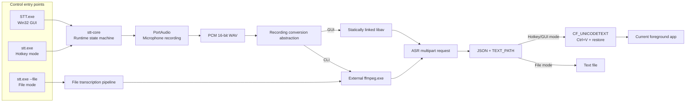
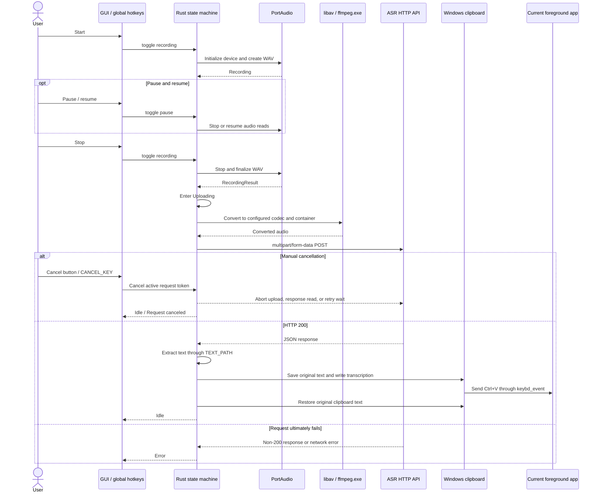
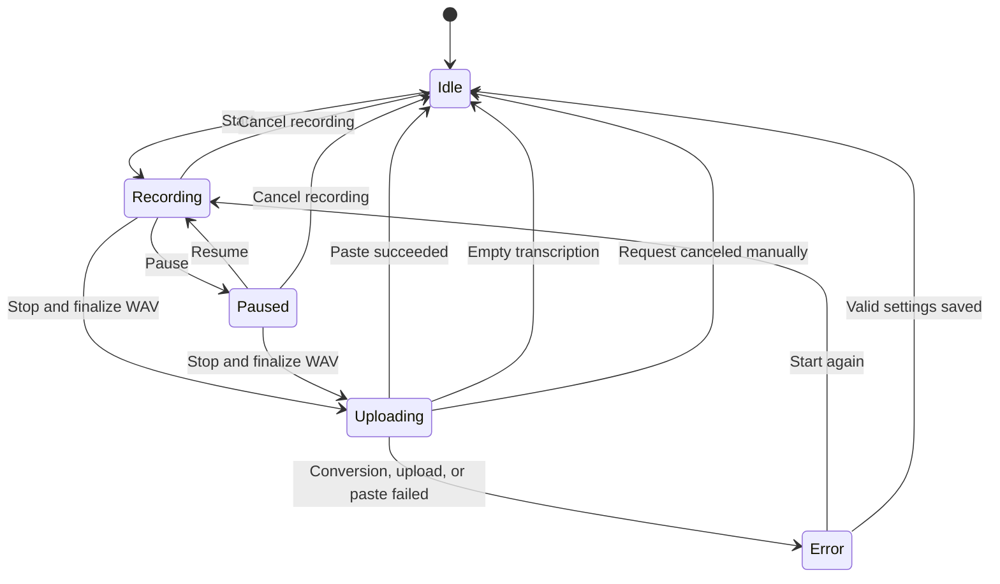

English | [简体中文](README_ZH.md)

# STT for Windows

STT for Windows is a local speech-to-text client for Windows x86_64. It records microphone audio through global hotkeys or a native floating window, sends the completed audio file to a compatible ASR HTTP endpoint, extracts the transcription, and automatically pastes it at the current input position.

The project provides two Rust programs:

- `STT.exe`: a native Win32 GUI that statically links PortAudio and a trimmed FFmpeg/libav build, ready to run after extraction.
- `stt.exe`: a command-line program that supports hotkey-controlled recording and transcription of existing audio files, using `ffmpeg.exe` from `PATH` for audio conversion.

The current implementation is built with Rust, Win32, Direct2D, and DirectWrite.

## Features

- **Native Windows GUI**
  - Borderless, always-on-top floating window with per-monitor DPI support.
  - Full mode, minimal toolbar, system tray integration, taskbar visibility control, and a native settings window.
  - Interface languages: English, Simplified Chinese, German, Japanese, and French.
- **Global hotkey recording**
  - Start or stop recording, pause or resume recording, and cancel a recording or an in-flight transcription request.
  - Uses a low-level keyboard hook by default, with `RegisterHotKey` available as an alternative.
- **General-purpose ASR HTTP interface**
  - Uploads audio through `multipart/form-data` with a fixed file field named `file`.
  - Supports Bearer tokens, model, language, prompt, and custom form fields.
  - Supports request timeouts, exponential-backoff retries, HTTP/2, and TLS certificate verification.
- **Cancelable processing pipeline**
  - Recording, external FFmpeg conversion, HTTP upload, response reading, retry waits, and clipboard waits are all cancellation-aware.
  - The cancel button and cancel hotkey remain available while the GUI is in the `Uploading` state.
- **Automatic extraction and paste**
  - Uses `TEXT_PATH` to read text from JSON responses, including nested objects and repeated array indexes.
  - Saves the original clipboard text, sends `Ctrl+V`, and then attempts to restore it.
- **Separate GUI and CLI backends**
  - The GUI statically links libav and never searches for or launches an external FFmpeg executable.
  - The CLI uses `ffmpeg.exe` from the system `PATH`, allowing the encoder installation to be managed independently.
- **Caching and diagnostics**
  - Optionally retains the original WAV, converted audio, and successful response.
  - Provides debug output for recording, conversion, hotkeys, and uploads.

## Downloads

| Component | Download | SHA-256 |
|---|---|---|
| GUI | [stt-gui-windows-amd64.zip](https://github.com/Joey-Kot/STT-for-Windows/releases/download/Latest/stt-gui-windows-amd64.zip) | [sha256](https://github.com/Joey-Kot/STT-for-Windows/releases/download/Latest/stt-gui-windows-amd64.zip.sha256) |
| CLI | [stt-cli-windows-amd64.zip](https://github.com/Joey-Kot/STT-for-Windows/releases/download/Latest/stt-cli-windows-amd64.zip) | [sha256](https://github.com/Joey-Kot/STT-for-Windows/releases/download/Latest/stt-cli-windows-amd64.zip.sha256) |

### Which version should I use?

| Use case | Recommended version |
|---|---|
| Daily desktop use with floating-window configuration and controls | `STT.exe` GUI |
| Automation, scripts, or terminal-based hotkey recording | `stt.exe` CLI |
| Transcribing an existing audio file to a text file | `stt.exe` CLI |
| No FFmpeg installation desired | `STT.exe` GUI |
| Independently managing or replacing FFmpeg | `stt.exe` CLI |

## Architecture

`stt-core` handles configuration, recording, the runtime state machine, ASR requests, caching, hotkeys, and clipboard operations. The GUI and CLI provide different interaction models and audio conversion backends.



The GUI and CLI share the same configuration format and ASR request semantics. Their main differences are the interface, configuration file location, and conversion backend.

## Recording and transcription flow



The application does not stream audio while recording. Conversion and the ASR request begin only after recording has stopped and the WAV file has been finalized.

## Runtime state machine



Normal actions use a non-queuing action lock. Repeated start, stop, or pause actions received while busy are dropped instead of being queued for later execution. Cancellation in the `Uploading` state is the exception: it bypasses the action lock and directly cancels the active request token.

## Capabilities and current limitations

- Current releases provide Windows x86_64 builds only.
- The GUI is a native Windows-only application. The CLI source can be compiled on other systems, but global Windows hotkeys are available only on Windows.
- Recording uses the system default input device. There is currently no microphone device selector.
- The complete audio file is uploaded after recording; real-time streaming transcription is not supported.
- The ASR endpoint must accept `multipart/form-data` and return JSON.
- Only HTTP 200 is treated as success. Other status codes enter the retry or failure path.
- The HTTP client does not use system proxies, follow redirects automatically, or enable automatic response compression.
- GUI libav conversion is a synchronous C ABI call, so cancellation is checked before and after the call. HTTP upload, response reading, and retry waits can be canceled immediately.
- Automatic paste targets the foreground application when transcription finishes. Changing focus while waiting changes the final paste target.
- The GUI does not provide Windows Toast notifications, tray balloons, or other system notifications.
- `NOTIFICATION` in older configuration files is ignored and is not written back when the configuration is saved.
- `REQUEST_FAILED_NOTIFICATION` is not a system notification switch. It only controls whether `[request failed]` is pasted after all retries are exhausted.

## Requirements

### GUI

- Windows 10 or Windows 11 x86_64.
- A working default microphone input device.
- A compatible ASR HTTP endpoint.
- No FFmpeg, PortAudio, WebView2, or Visual C++ Redistributable installation is required.

### CLI

- Windows x86_64.
- A microphone for hotkey recording mode.
- `ffmpeg.exe` available through `PATH`.
- A compatible ASR HTTP endpoint.

Verify FFmpeg:

```powershell
ffmpeg -version
```

### Source development

- Rust 1.97 or newer.
- The Rust `x86_64-pc-windows-gnu` target.
- MinGW-w64, C/C++ build tools, `pkg-config`, Autoconf, Automake, Libtool, NASM, YASM, and XZ tools.
- Network access to obtain the PortAudio, FFmpeg, and codec sources when building the static GUI dependencies.

## GUI usage

### First run

1. Download and extract `stt-gui-windows-amd64.zip`.
2. Run `STT.exe`.
3. The application creates a default configuration at:

```text
%APPDATA%\stt\config.json
```

4. Open settings through the gear button on the floating window or the tray menu.
5. Set at least `API_ENDPOINT`, along with `TOKEN`, `MODEL`, and `TEXT_PATH` as required by the service.
6. Save the settings, then start recording with the floating-window button or the default hotkey.

The interface language is stored separately at:

```text
%APPDATA%\stt\ui-language.txt
```

The interface language is not written to the ASR configuration file and does not change the `LANGUAGE` field sent in requests.

### Floating-window controls

| Control | Available states | Behavior |
|---|---|---|
| Microphone | `Idle`, `Error`, `Recording`, `Paused` | Starts recording, or stops recording and enters the transcription pipeline |
| Pause/play | `Recording`, `Paused` | Pauses or resumes recording |
| Cancel | `Recording`, `Paused`, `Uploading` | Deletes the current recording or cancels the in-flight transcription request |
| Gear | Any state before shutdown | Opens the native settings window |
| `-` / `+` | Any state | Switches between the full floating window and minimal toolbar |
| Top drag handle | Full mode | Moves the floating window |
| Toolbar background or button drag | Minimal mode | Moves the toolbar; exceeding the drag threshold suppresses the button action |

Full mode displays a taskbar tab. Minimal mode hides the taskbar tab while retaining the tray icon. The tray menu contains `Minimal`, `Settings`, and `Quit`; double-clicking the tray icon restores full mode.

### Settings window

| Page | Contents |
|---|---|
| Display | Interface language and configuration file location |
| API | Endpoint, token, model, language, prompt, text path, and extra fields |
| Audio | Channels, sample rate, sample depth, bitrate, codec, and container |
| Network | Timeout, retries, HTTP/2, and TLS verification |
| Hotkeys | Three hotkeys, the low-level keyboard hook switch, and two clipboard wait intervals |
| Cache | Cache directory, cache retention, and request-failure placeholder text |
| Debug | FFmpeg, recording, hotkey, and upload diagnostics |
| About | Project, author, license, and repository information |

Settings can be saved only in the `Idle` or `Error` state. When settings are saved, the application validates the configuration, rebuilds the ASR client and recorder, and registers the hotkeys again.

### Exit

- Pressing `Esc` closes the settings window first. If settings are not open, it starts the exit flow.
- Exiting while recording, paused, or uploading displays a confirmation dialog.
- Exiting cancels recording and the active request, removes the tray icon, and stops the hotkey thread.

## Command-line program

`stt.exe` supports two modes:

- **Hotkey mode**: remains active in a terminal and uses global hotkeys to record, transcribe, and paste.
- **File mode**: transcribes an existing audio file and writes the text to a specified file.

### Configuration lookup and precedence

Configuration precedence is:

```text
Command-line overrides > JSON selected by --config > config.json in the current directory > defaults
```

If `--config` is not provided, the current directory does not contain `config.json`, and no configuration override is supplied, the CLI creates a default `config.json`, prints its path, and exits. Edit the file and run the program again.

All long options use the standard double-hyphen form. Boolean options require an explicit `true` or `false` value. Legacy single-hyphen long options and the removed `--notification` option are not supported.

### Hotkey mode

Use the configuration in the current directory:

```powershell
.\stt.exe
```

Select a configuration file:

```powershell
.\stt.exe --config .\config.json
```

Use command-line overrides only:

```powershell
.\stt.exe `
  --api-endpoint "https://api.example.com/v1/audio/transcriptions" `
  --token "your-token" `
  --model "your-model" `
  --text-path "text"
```

After startup, the program prints state changes to the terminal. Press `Ctrl+C` to exit.

### File mode

```powershell
.\stt.exe `
  --config .\config.json `
  --file .\sample.wav `
  --output .\sample.txt
```

If `--output` is omitted, the default output is `<input-file-name>.txt` in the current directory. File mode first converts the input according to the audio configuration and then uploads it for transcription. It does not register global hotkeys or paste automatically.

### CLI options

`--help` displays options in groups corresponding to the GUI settings pages.

#### General

| Option | Purpose |
|---|---|
| `--config <PATH>` | Selects a JSON configuration file |
| `--file <PATH>` | Enters file mode with an existing audio file |
| `--output <PATH>` | Sets the text output path for file mode |

#### API

| Option | Purpose |
|---|---|
| `--api-endpoint <URL>` | Overrides the ASR endpoint |
| `--token <TOKEN>` | Overrides the Bearer token |
| `--model <MODEL>` | Overrides the model field |
| `--language <LANGUAGE>` | Overrides the request language field |
| `--prompt <TEXT>` | Overrides the prompt |
| `--text-path <PATH>` | Overrides the response text path |
| `--extra-config <JSON>` | Overrides the stringified extra JSON object |

#### Audio

| Option | Purpose |
|---|---|
| `--codecs <CODEC>` | Overrides the audio codec |
| `--container <FORMAT>` | Overrides the audio container |
| `--channels <N>` | Overrides the channel count |
| `--sampling-rate <HZ>` | Overrides the sample rate; `--rate` is a compatibility alias |
| `--sampling-rate-depth <BITS>` | Overrides the conversion sample depth |
| `--bit-rate <KBPS>` | Overrides the audio bitrate |

#### Network

| Option | Purpose |
|---|---|
| `--request-timeout <SECONDS>` | Overrides the per-request client timeout |
| `--max-retry <N>` | Overrides the maximum number of request attempts |
| `--retry-base-delay <SECONDS>` | Overrides the initial exponential-backoff delay |
| `--enable-http2 <BOOL>` | Enables or disables HTTP/2 |
| `--verify-ssl <BOOL>` | Enables or disables TLS certificate verification |

#### Hotkeys

| Option | Purpose |
|---|---|
| `--start-key <HOTKEY>` | Overrides the start/stop hotkey |
| `--pause-key <HOTKEY>` | Overrides the pause/resume hotkey |
| `--cancel-key <HOTKEY>` | Overrides the recording/request cancellation hotkey |
| `--hotkey-hook <BOOL>` | Selects the low-level keyboard hook or `RegisterHotKey` |
| `--clipboard-write-delay <MS>` | Overrides the wait after writing the transcription and before sending `Ctrl+V` |
| `--clipboard-restore-delay <MS>` | Overrides the wait after sending `Ctrl+V` and before restoring the original clipboard |

#### Cache

| Option | Purpose |
|---|---|
| `--cache-dir <PATH>` | Overrides the cache directory |
| `--keep-cache <BOOL>` | Controls whether cache files are retained |
| `--request-failed-notification <BOOL>` | Controls whether `[request failed]` is pasted after failure |

#### Debug

| Option | Purpose |
|---|---|
| `--ffmpeg-debug <BOOL>` | Enables FFmpeg debug output |
| `--record-debug <BOOL>` | Enables recording debug output |
| `--hotkey-debug <BOOL>` | Enables hotkey debug output |
| `--upload-debug <BOOL>` | Enables upload debug output |

`--help` displays the complete help text, and `--version` displays the version.

Clap returns exit code `2` for argument parsing failures. Runtime, request, conversion, or file errors return `1`. Success and the initial creation of a default configuration return `0`.

## Configuration file

The GUI and CLI use the same JSON data structure. Missing fields receive their default values, and unknown fields are ignored.

### OpenAI-compatible endpoint example

```json
{
  "API_ENDPOINT": "https://api.openai.com/v1/audio/transcriptions",
  "TOKEN": "sk-xxx",
  "MODEL": "gpt-4o-mini-transcribe",
  "LANGUAGE": "zh",
  "PROMPT": "",
  "TEXT_PATH": "text",
  "ExtraConfig": "{\"response_format\":\"json\",\"temperature\":0}",
  "CHANNELS": 1,
  "SAMPLING_RATE": 16000,
  "SAMPLING_RATE_DEPTH": 16,
  "BIT_RATE": 128,
  "CODECS": "mp3",
  "CONTAINER": "mp3",
  "REQUEST_TIMEOUT": 300,
  "MAX_RETRY": 3,
  "RETRY_BASE_DELAY": 0.5,
  "ENABLE_HTTP2": true,
  "VERIFY_SSL": true,
  "HOTKEY_HOOK": true,
  "START_KEY": "ctrl+alt+q",
  "PAUSE_KEY": "ctrl+alt+s",
  "CANCEL_KEY": "alt+esc",
  "CLIPBOARD_WRITE_DELAY": 80,
  "CLIPBOARD_RESTORE_DELAY": 120,
  "CACHE_DIR": "",
  "KEEP_CACHE": false,
  "REQUEST_FAILED_NOTIFICATION": false,
  "FFMPEG_DEBUG": false,
  "RECORD_DEBUG": false,
  "HOTKEY_DEBUG": false,
  "UPLOAD_DEBUG": false
}
```

This is only a protocol example. The actual model name, fields, supported audio formats, and timeout should follow the requirements of the selected ASR service. Keep `VERIFY_SSL=true` for normal public services.

### API and response fields

| Field | Default | Behavior |
|---|---:|---|
| `API_ENDPOINT` | `""` | ASR POST endpoint; must not be empty when uploading |
| `TOKEN` | `""` | Sends `Authorization: Bearer <token>` when non-empty |
| `MODEL` | `""` | Sends the multipart field `model` when non-empty |
| `LANGUAGE` | `""` | Sends the multipart field `language` when non-empty |
| `PROMPT` | `""` | Sends the multipart field `prompt` when non-empty |
| `TEXT_PATH` | `"text"` | Reads the transcription from the JSON response |
| `ExtraConfig` | `""` | Stringified JSON object used to add, remove, or override multipart fields |

### Audio fields

| Field | Default | Validation and behavior |
|---|---:|---|
| `CHANNELS` | `1` | Allowed range: 1–8; used by both recording and conversion |
| `SAMPLING_RATE` | `16000` | Must be greater than 0, in Hz |
| `SAMPLING_RATE_DEPTH` | `16` | Allowed values: 8, 16, 24, or 32; affects conversion only and does not change the recorded WAV from PCM 16-bit |
| `BIT_RATE` | `32` | Must be greater than 0, in kbps |
| `CODECS` | `"opus"` | Encoder name or compatible alias, case-insensitive |
| `CONTAINER` | `"ogg"` | Output container/extension, case-insensitive |

Common outputs covered by the static GUI build include Opus/Ogg, MP3, AAC, FLAC, Vorbis, and WAV/PCM. The build also includes several additional encoders and muxers; the selected codec and container must form a valid combination.

### Network fields

| Field | Default | Behavior |
|---|---:|---|
| `REQUEST_TIMEOUT` | `60` | Positive values set the reqwest client timeout in seconds; non-positive values leave it unset |
| `MAX_RETRY` | `3` | Maximum number of request attempts, including the first request |
| `RETRY_BASE_DELAY` | `0.5` | Delay in seconds before the first retry, doubled after each failure |
| `ENABLE_HTTP2` | `true` | Forces HTTP/1 when `false` |
| `VERIFY_SSL` | `true` | Accepts invalid TLS certificates when `false`; not recommended for public services |

### Hotkey, clipboard, cache, and debug fields

| Field | Default | Behavior |
|---|---:|---|
| `HOTKEY_HOOK` | `true` | Uses `WH_KEYBOARD_LL` when `true`; uses `RegisterHotKey` when `false` |
| `START_KEY` | `"ctrl+alt+q"` | Starts or stops recording |
| `PAUSE_KEY` | `"ctrl+alt+s"` | Pauses or resumes recording |
| `CANCEL_KEY` | `"alt+esc"` | Cancels recording or the active transcription request |
| `CLIPBOARD_WRITE_DELAY` | `80` | Milliseconds between writing the transcription and sending `Ctrl+V` |
| `CLIPBOARD_RESTORE_DELAY` | `120` | Milliseconds between sending `Ctrl+V` and restoring the original clipboard |
| `CACHE_DIR` | `""` | When non-empty, attempts to create it and convert it to an absolute path; on failure, falls back to the current directory and clears the setting |
| `KEEP_CACHE` | `false` | Retains cache files only when `CACHE_DIR` is non-empty and usable |
| `REQUEST_FAILED_NOTIFICATION` | `false` | Pastes `[request failed]` after retries are exhausted; does not send a system notification |
| `FFMPEG_DEBUG` | `false` | Prints conversion backend information |
| `RECORD_DEBUG` | `false` | Prints recording diagnostics |
| `HOTKEY_DEBUG` | `true` | Prints hotkey registration and busy-action diagnostics |
| `UPLOAD_DEBUG` | `false` | Prints the upload target, attempt count, and failed-response summary |

## ASR API compatibility requirements

The application sends an HTTP POST request:

```http
POST <API_ENDPOINT>
User-Agent: stt-go-client/1.0
Content-Type: multipart/form-data; boundary=<generated automatically>
```

When `TOKEN` is non-empty, the client also sends `Authorization: Bearer <TOKEN>`. The multipart `boundary` parameter is generated automatically for each request and should not be fixed manually in server-side configuration.

Multipart contents:

| Field | Sent when |
|---|---|
| `file` | Always; contains the converted audio and uses the local filename |
| `model` | `MODEL` is non-empty |
| `language` | `LANGUAGE` is non-empty |
| `prompt` | `PROMPT` is non-empty |
| Other fields | Supplied by `ExtraConfig` |

Every retry reopens the audio file and rebuilds the multipart request body. System proxies, automatic redirects, and automatic gzip/brotli/deflate decompression are disabled.

### ExtraConfig

`ExtraConfig` is itself a JSON string whose contents must be a JSON object:

```json
{
  "ExtraConfig": "{\"response_format\":\"json\",\"temperature\":0,\"stream\":false}"
}
```

Merge rules:

- Strings, booleans, and numbers are converted to regular form text.
- Objects and arrays are serialized as compact JSON strings.
- Fields with the same name override `model`, `language`, or `prompt`.
- A `null` value removes the corresponding built-in field.
- Merging is shallow; objects are not merged recursively.

For example, this configuration removes `language` and overrides `model`:

```json
{
  "ExtraConfig": "{\"language\":null,\"model\":\"custom-model\"}"
}
```

### TEXT_PATH

`TEXT_PATH` uses dot-separated object fields and allows any number of array indexes after a field:

```text
text
result.transcript
results[0].alternatives[0].transcript
data.items[0][1].text
```

Strings, numbers, and booleans are converted to text. If the configured path cannot be read, the application tries, in order:

1. Top-level `text`.
2. The first non-empty top-level string field.
3. An empty string.

Text cannot be extracted from a non-JSON response. If an HTTP 200 response produces an empty result, the state returns to `Idle` without pasting placeholder text.

### Retries and cancellation

- Request errors and non-200 responses enter the retry flow.
- `MAX_RETRY` includes the first request.
- The wait begins at `RETRY_BASE_DELAY` and is multiplied by 2 after each failure.
- Manual cancellation aborts an in-progress request send, response read, or retry wait.
- Cancellation is not an error: the GUI returns to `Idle` and displays “Request canceled.”
- `[request failed]` is pasted only when retries are exhausted and `REQUEST_FAILED_NOTIFICATION=true`.

## Default hotkeys and syntax

| Action | Default hotkey |
|---|---|
| Start/stop recording | `ctrl+alt+q` |
| Pause/resume recording | `ctrl+alt+s` |
| Cancel recording/transcription request | `alt+esc` |

Supported modifier aliases:

- `alt`, `menu`
- `ctrl`, `control`
- `shift`
- `win`, `meta`, `super`

Supported keys include letters, digits, `F1`–`F24`, arrow keys, `Esc`, `Space`, `Enter`, `Tab`, `Backspace`, `Insert`, `Delete`, `Home`, `End`, `PageUp`, `PageDown`, and numeric keypad aliases.

Hotkeys are case-insensitive. Repeated modifiers, unknown keys, and equivalent duplicate bindings across the three actions are rejected.

When `HOTKEY_HOOK=true`, the low-level keyboard hook:

- Ignores injected keyboard events.
- Suppresses repeated triggers while a hotkey is held.
- Requires the configured modifiers but allows additional modifiers to be held.

When `HOTKEY_HOOK=false`, the application uses `RegisterHotKey` with `MOD_NOREPEAT`.

## Clipboard and automatic paste

The Windows GUI and hotkey mode use `CF_UNICODETEXT`:

1. Read and save the current clipboard text.
2. Write the transcription.
3. Wait `CLIPBOARD_WRITE_DELAY` milliseconds; the default is 80.
4. Send `Ctrl+V` through `keybd_event`.
5. Wait `CLIPBOARD_RESTORE_DELAY` milliseconds; the default is 120.
6. Attempt to restore the original clipboard text whether or not the preceding steps succeeded.

Both wait intervals are available on the GUI `Hotkeys` page and through the corresponding JSON fields or CLI `Hotkeys` option group. Missing fields retain the 80 ms and 120 ms defaults.

The project explicitly does not use `SendInput`. If the paste shortcut was sent but restoration of the original clipboard failed, the application distinguishes that condition from a failure before paste.

## Cache and temporary files

At startup, the application removes every file or directory in the active temporary directory whose name begins with `RecordTemp_`.

Temporary recording names:

```text
RecordTemp_<16 hexadecimal characters>.wav
```

The converted file keeps the same base name and uses the configured container extension. When both input and output are WAV, `_convert` is added to the converted filename to avoid overwriting the original recording.

When `KEEP_CACHE=false` or `CACHE_DIR` is empty, temporary audio is deleted after processing. When caching is enabled, files are renamed to:

```text
audio-YYYY-MM-DD-HH.MM.SS.<ext>
```

Only an HTTP 200 response is written to the corresponding `.json` file. Failures and cancellations before a successful response do not produce a response JSON file.

## Build from source

Official releases are cross-compiled on Ubuntu using MinGW-w64 and the Rust `x86_64-pc-windows-gnu` target.

### Install the Rust target

```bash
rustup target add x86_64-pc-windows-gnu
rustup component add rustfmt clippy
```

### Tests and static checks

```bash
cargo fmt --all --check
cargo test --workspace
cargo clippy --workspace --all-targets -- -D warnings
cargo check --workspace \
  --target x86_64-pc-windows-gnu \
  --features stt-gui/native-gui
```

### Build native dependencies and programs

```bash
scripts/build-portaudio-windows-amd64.sh
scripts/build-ffmpeg-windows-amd64.sh
scripts/build-rust-windows-amd64.sh
scripts/package-windows-release.sh
```

Build outputs:

```text
dist/cli/stt.exe
dist/gui/STT.exe
dist/stt-cli-windows-amd64.zip
dist/stt-gui-windows-amd64.zip
```

`scripts/build-portaudio-windows-amd64.sh` builds the PortAudio WMME backend without WASAPI. After using `--disable-everything`, `scripts/build-ffmpeg-windows-amd64.sh` enables only the protocols, WAV decoder, audio encoders, and muxers required by the GUI.

GitHub Actions also verifies:

- Formatting, tests, and `clippy -D warnings`.
- Windows API and MinGW target compilation.
- The PortAudio backend includes WMME and excludes WASAPI.
- The FFmpeg build does not enable `nonfree`.
- The GUI does not import `SendInput`.
- The GUI does not contain the external FFmpeg backend.
- The GUI has no dynamic dependency on PortAudio or libav DLLs.
- `NOTICE` and `THIRD_PARTY_LICENSES/` are complete.

After a successful build, the workflow updates the `Latest` tag and Release, then uploads the GUI, CLI, and their SHA-256 files.

## Security and privacy

- Recording and conversion are performed locally by default. Only the converted audio is sent to `API_ENDPOINT`.
- `TOKEN` is stored as plaintext in the JSON configuration. The GUI password field only masks the displayed value and does not encrypt it on disk.
- Keep `VERIFY_SSL=true` for public services.
- `VERIFY_SSL=false` accepts invalid certificates and may expose the connection to man-in-the-middle attacks.
- The HTTP client does not read system proxy settings. If a proxy is required, handle it through a trusted gateway or at the API endpoint.
- The application does not verify whether the configured API is trustworthy. Use only services to which you are willing to send the recording.
- `CACHE_DIR` may contain original recordings, converted audio, and service responses and should be handled as sensitive data.
- Automatic paste depends on the current foreground window. After starting a recording, do not leave input focus in a window that should not receive the transcription.

## Implementation constraints

- Recording: PortAudio C blocking API, default input device, and WMME; WASAPI is not used.
- Recording format: interleaved signed int16; temporary WAV files are always PCM 16-bit.
- GUI conversion: statically linked libav C ABI; does not launch `ffmpeg.exe`.
- CLI conversion: external `ffmpeg.exe`; cancellation terminates the child process.
- GUI: Win32 message loop, Direct2D, DirectWrite, and native controls; no embedded WebView.
- Tray: `Shell_NotifyIconW`; no tray balloons.
- Paste: `keybd_event`; `SendInput` is not used.
- Notifications: no Windows system notifications.
- Configuration: validated before saving; missing fields use defaults, and unknown fields are ignored.

For precise compatibility behavior, see the [Rust rewrite compatibility contract](docs/rust-rewrite-contract.md). For the boundary between automated and manual validation, see the [Rust technical validation record](docs/rust-technical-validation.md).

## Repository layout

| Component | Path | Purpose / output |
|---|---|---|
| Core library | `crates/stt-core/` | Configuration, ASR, cache, recording, hotkeys, clipboard, and state machine |
| CLI | `crates/stt-cli/` | `stt.exe` |
| Native GUI | `crates/stt-gui/` | `STT.exe` |
| libav bridge | `native/` | C ABI used by the GUI |
| Build scripts | `scripts/` | PortAudio, FFmpeg, Rust, and release package builds |
| Windows resources | `assets/` | Application icon and other resources |
| Example configurations | `examples/` | Provider configuration examples |
| Behavior and validation documentation | `docs/` | Rust compatibility contract and technical validation record |
| Release workflow | `.github/workflows/latest-release.yml` | Builds and updates the `Latest` Release |

## Third-party components

The GUI release package statically links:

- FFmpeg/libav n7.1.1
- PortAudio v19.7.0
- Opus v1.5.2
- LAME 3.100
- libogg 1.3.5
- libvorbis 1.3.7
- OpenCore AMR 0.1.6

See [THIRD_PARTY_NOTICES.txt](THIRD_PARTY_NOTICES.txt) for a summary. Complete license texts are in [THIRD_PARTY_LICENSES/](THIRD_PARTY_LICENSES/).

## License

This project is licensed under the [GNU General Public License v3.0 or later](LICENSE).

Copyright © 2026 Joey Kot <joey.kot.x@gmail.com>
