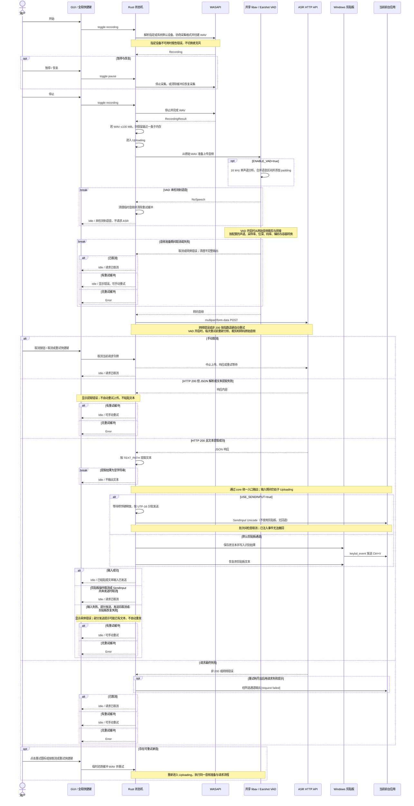
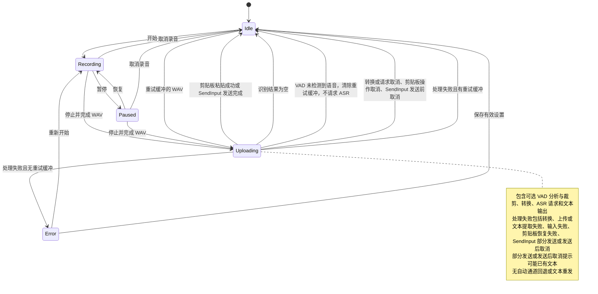

[English](README.md) | [简体中文](README_ZH.md)

# STT for Windows

STT for Windows 是一个面向 Windows x86_64 的本地语音转文字客户端。它通过全局快捷键或原生浮窗录制麦克风音频，将完整音频文件发送到兼容的 ASR HTTP 接口，提取识别文本后自动粘贴到当前输入位置。

项目包含两个 Rust 程序：

- `STT.exe`：原生 Win32 图形界面，使用 Windows WASAPI 采集音频，静态链接裁剪版 FFmpeg/libav，解压即可运行。
- `stt.exe`：命令行程序，支持快捷键录音和现有音频文件转写，与 GUI 共用内嵌 libav 转换器，无需安装系统 FFmpeg。

当前使用 Rust、Win32、Direct2D 和 DirectWrite 实现。

## 功能特性

- **原生 Windows GUI**
  - 无边框、始终置顶、支持每显示器 DPI 的浮窗。
  - Windows 10 和 Windows 11 的浮窗及设置窗口统一使用抗锯齿自绘圆角，不叠加系统外框或第二层圆角。
  - 完整模式、minimal 工具条、系统托盘、任务栏显示控制和原生设置窗口。
  - 完整模式和 minimal 模式共用可配置的透明度，以及 `0.3`–`2.0` 浮窗缩放。
  - 支持英文、简体中文、德语、日语和法语界面。
- **全局快捷键录音**
  - 开始或停止录音、暂停或恢复录音、取消录音或正在等待的识别请求。
  - 空闲且存在可重试录音时，取消或重试快捷键会重新提交该录音。
  - 默认使用低级键盘钩子，也可以改用 `RegisterHotKey`。
  - GUI 的三个快捷键输入框支持直接按下组合录入，无需手填格式。
- **通用 ASR HTTP 接口**
  - 通过 `multipart/form-data` 上传音频，文件字段固定为 `file`。
  - 支持 Bearer Token、模型、语言、提示词和自定义表单字段。
  - 支持请求超时、指数退避重试、HTTP/2 和 TLS 证书校验。
- **可取消的处理链路**
  - 录音、内嵌 FFmpeg 转换、HTTP 上传、响应读取、重试等待和剪贴板等待均接入取消机制。
  - 请求处于 `Uploading` 状态时，GUI 保持取消按钮可用；两个程序均保持取消或重试快捷键可用。
- **录音重试**
  - GUI 和 CLI 的快捷键模式仅在进程内保存最近一条已结束录音，大小上限为 100,000,000 字节；退出程序时释放。
  - GUI 会复用取消按钮的位置显示重试；两个程序都在空闲且存在可重试录音时复用取消或重试快捷键。
- **自动提取与粘贴**
  - 使用 `TEXT_PATH` 中的标准 JSONPath 从 JSON 响应中选取唯一值，支持嵌套字段、数组索引和条件过滤。
  - 暂存原剪贴板文本，发送 `Ctrl+V` 后再尝试恢复。
- **共享内嵌音频处理**
  - GUI 和 CLI 共用 `stt-core` 的麦克风枚举、稳定设备标识选择和设备默认格式采集。
  - 两个程序均静态链接 libav，不搜索或启动外部 FFmpeg。
  - 可选 Earshot VAD 在 16 kHz 单声道支路检测语音，裁剪使用原始音频。
- **缓存与诊断**
  - 可选择保留原始 WAV、转码音频和成功响应。
  - 提供录音、转换、快捷键和上传调试输出。

## 下载

| 组件 | 下载 | SHA-256 |
|---|---|---|
| GUI | [stt-gui-windows-amd64.zip](https://github.com/Joey-Kot/STT-for-Windows/releases/download/Latest/stt-gui-windows-amd64.zip) | [sha256](https://github.com/Joey-Kot/STT-for-Windows/releases/download/Latest/stt-gui-windows-amd64.zip.sha256) |
| CLI | [stt-cli-windows-amd64.zip](https://github.com/Joey-Kot/STT-for-Windows/releases/download/Latest/stt-cli-windows-amd64.zip) | [sha256](https://github.com/Joey-Kot/STT-for-Windows/releases/download/Latest/stt-cli-windows-amd64.zip.sha256) |

### 应该选择哪个版本

| 使用场景 | 推荐版本 |
|---|---|
| 日常桌面使用、希望通过浮窗配置和操作 | `STT.exe` GUI |
| 自动化、脚本调用、终端快捷键录音 | `stt.exe` CLI |
| 转写已有音频并输出文本文件 | `stt.exe` CLI |
| 不想安装 FFmpeg | GUI 或 CLI |

## 架构

`stt-core` 负责配置、麦克风枚举与选择、采集格式协商、录音、状态机、ASR、缓存、快捷键和剪贴板。GUI 与 CLI 共用这些实现。

```mermaid
flowchart LR
    subgraph Entry["控制入口"]
        GUI["STT.exe<br/>Win32 GUI"]
        CLI["stt.exe<br/>快捷键模式"]
        FileMode["stt.exe --file<br/>文件模式"]
    end

    GUI --> Runtime["stt-core<br/>运行时状态机"]
    CLI --> Runtime
    FileMode --> FilePipeline["文件转写流程"]

    Runtime --> Recorder["WASAPI<br/>指定麦克风 / 系统默认"]
    Recorder --> WAV["保留采集采样率、声道和精度的 WAV"]

    WAV --> Convert["stt-core 共享音频准备入口"]
    WAV --> RetryBuffer["GUI 和 CLI 重试缓冲<br/>最近一条已结束 WAV，仅内存，≤100 MB"]
    RetryBuffer -->|临时还原原始 WAV| Convert
    FilePipeline --> Convert
    Convert --> VAD{ENABLE_VAD}
    VAD -->|false，默认| LibAv["内嵌 libav<br/>从原始音频按配置重采样、编码与封装"]
    VAD -->|true| Analyze["内嵌 libav 解码为 16 kHz 单声道 PCM<br/>Earshot 检测语音区间"]
    Analyze --> Speech{有语音区间?}
    Speech -->|有| Trim["合并区间并添加 padding<br/>映射至原始音频，裁剪与拼接"]
    Trim --> LibAv
    Speech -->|无| NoSpeech["不请求 ASR<br/>录音模式清除重试缓冲并返回 Idle<br/>文件模式提示无语音并正常退出"]
    LibAv --> Request["ASR multipart 请求"]
    Request --> Extract["JSON + TEXT_PATH"]

    Extract -->|快捷键/GUI 模式| Channel{USE_SENDINPUT}
    Channel -->|false，默认| Clipboard["CF_UNICODETEXT<br/>Ctrl+V + 恢复"]
    Channel -->|true| Unicode["SendInput Unicode<br/>不使用剪贴板，无回退"]
    Clipboard --> App["当前前台应用"]
    Unicode --> App
    Extract -->|文件模式| TextFile["文本文件"]
```



GUI 和 CLI 共用相同的配置格式与 ASR 请求语义。两者的主要差别是界面和配置文件位置。

## 录音与识别流程



系统不会边录音边流式上传。只有停止录音并完成 WAV 后，才会进行转码和 ASR 请求。完成的 WAV 超过 100,000,000 字节时，请求仍会正常进行，但 GUI 和 CLI 的快捷键模式不会保留它用于重试；此时处理最终失败会进入 `Error`。

## 运行时状态机



普通动作使用一个非排队动作锁。繁忙时重复的开始、停止或暂停动作会被丢弃，不会排队到稍后执行。`Uploading` 状态下的取消是例外：它绕过动作锁，直接取消当前请求令牌。

只有结束一段新的录音才会替换重试缓冲。录制中取消会保留上一条缓冲录音；上传中取消会保留刚取消请求的录音。重试成功或失败后，仍保留同一条缓冲录音。VAD 未检测到语音是例外：会清除重试缓冲，不请求 ASR，并返回 `Idle`。

## 功能范围与当前限制

- 当前 Release 只提供 Windows x86_64 构建。
- GUI 是 Windows 专用原生程序；CLI 源码可在其他系统编译，但全局 Windows 快捷键功能只在 Windows 可用。
- 麦克风采集和设备枚举仅支持 Windows。GUI 和 CLI 均可指定录音输入设备或跟随系统默认，每次开始录音时重新解析设备。
- 录音后一次性上传完整音频，不支持实时流式识别。
- ASR 接口必须接受 `multipart/form-data` 并返回 JSON。
- 只有 HTTP 200 被视为成功；其他状态码进入重试或失败流程。
- HTTP 客户端不使用系统代理、不自动跟随重定向，也不启用自动响应压缩。
- 内嵌 libav 在阻塞工作线程运行，解码、区间处理和文件 I/O 均接入取消回调；清理会等待工作线程关闭输出。
- 自动粘贴发送到识别完成时的前台应用。用户在等待期间切换焦点，会改变最终粘贴目标。
- GUI 不提供 Windows Toast、托盘气泡或其他系统通知。
- 旧配置中的 `NOTIFICATION` 会被忽略，保存时不会重新写入。
- `REQUEST_FAILED_NOTIFICATION` 不是系统通知开关；它只控制重试耗尽后是否粘贴 `[request failed]`。

## 运行要求

### GUI

- Windows 10 或 Windows 11 x86_64。
- 可用的麦克风输入设备。
- 一个兼容的 ASR HTTP 接口。
- 无需安装 FFmpeg、PortAudio、WebView2 或 Visual C++ Redistributable。

### CLI

- Windows x86_64。
- 快捷键录音模式需要麦克风。
- 无需安装系统 FFmpeg。
- 一个兼容的 ASR HTTP 接口。

### 从源码开发

- Rust 1.97 或更新版本。
- `x86_64-pc-windows-gnu` Rust 目标。
- MinGW-w64、C/C++ 构建工具、`pkg-config`、Autoconf、Automake、Libtool、NASM、YASM 和 XZ 工具。
- 构建静态音频依赖时需要能够获取 FFmpeg 和编解码器源码。

## GUI 使用

### 首次启动

1. 下载并解压 `stt-gui-windows-amd64.zip`。
2. 运行 `STT.exe`。
3. 程序会在以下位置创建默认配置：

```text
%APPDATA%\stt\config.json
```

4. 通过浮窗齿轮按钮或托盘菜单打开设置。
5. 至少填写 `API_ENDPOINT`，并按服务要求填写 `TOKEN`、`MODEL` 和 `TEXT_PATH`。
6. 保存设置后使用浮窗按钮或默认快捷键开始录音。

界面语言单独保存在：

```text
%APPDATA%\stt\ui-language.txt
```

语言设置不会写入 ASR 配置文件，也不会改变请求中的 `LANGUAGE` 字段。

### 浮窗操作

| 控件 | 可用状态 | 行为 |
|---|---|---|
| 麦克风 | `Idle`、`Error`、`Recording`、`Paused` | 开始录音，或停止录音并进入识别流程 |
| 暂停/播放 | `Recording`、`Paused` | 暂停或恢复录音 |
| 取消 / 重试 | `Recording`、`Paused`、`Uploading`；存在可重试录音时的 `Idle` | 取消当前录音或正在等待的识别请求。`Idle` 且无可重试录音时，该位置仍显示不可用的取消图标；存在可重试录音时显示重试图标，并重新提交缓冲录音 |
| 齿轮 | 任意非关闭状态 | 打开原生设置窗口 |
| `-` / `+` | 任意状态 | 切换完整浮窗与 minimal 工具条 |
| 顶部拖动条 | 完整模式 | 移动浮窗 |
| 工具条空白区域或按钮拖动 | minimal 模式 | 移动工具条；超过拖动阈值时不会触发按钮动作 |

完整模式显示在任务栏；minimal 模式隐藏任务栏标签，但保留托盘图标。托盘菜单包含 `Minimal`、`Settings` 和 `Quit`，双击托盘图标会恢复完整模式。Display 页的浮窗缩放在保存后立即生效，同时缩放两种模式的窗口、绘制内容和鼠标命中区域。

### 设置窗口

| 页面 | 内容 |
|---|---|
| Display | 界面语言、配置文件位置、浮窗透明度和浮窗缩放 |
| API | 地址、Token、模型、语言、提示词、文本路径和额外字段 |
| Audio | 麦克风（第一项）、输出声道数、输出采样率、输出位深、比特率、编码器、容器、VAD 和边界填充 |
| Network | 超时、重试、HTTP/2 和 TLS 校验 |
| Hotkeys | 三个快捷键、低级键盘钩子开关、两个剪贴板等待时间和使用 SendInput 开关 |
| Cache | 缓存目录、缓存保留和请求失败占位文本 |
| Debug | FFmpeg、录音、快捷键和上传调试 |
| About | 项目、作者、许可证和仓库信息 |

只有 `Idle` 或 `Error` 状态允许保存设置。保存时程序会验证配置，重建 ASR 客户端和录音器，并重新注册快捷键。

Audio 第一项为“麦克风”，采用与 Display language 一致的下拉样式。第一项选项为“跟随系统默认”。打开设置或展开下拉列表时，会在后台刷新当前可用的录音输入设备；设备较多或名称较长时可以滚动查看。选择后保存，从下一次录音生效；取消设置则放弃本次选择。已选设备离线时保留选择并标记“设备不可用”，开始录音时报告错误，不会悄悄换用其他麦克风。同名设备通过设备标识区分。

Display language、麦克风和六个音频输出下拉列表共用带内边距的圆角面板，沿用深色与青绿色配色，选中项和悬停项通过不同底色区分。音频列表最多显示六行，超出后滚动；下方空间不足时向上展开。

输出声道数、位深度、采样率、码率、编码和容器均可通过预设选择。新配置默认为 **1 声道、16 位深度偏好、16000 Hz、128 kbps、Opus 编码和 `opus` 容器**。已有配置中的明确值保留，缺失字段使用新默认值。

- 声道数提供单声道和双声道，AMR-NB/WB 仅提供单声道。已有的非预设值（例如 6 声道）仍会显示并保留，除非主动修改，或与新选择的编码不兼容。
- 采样率预设覆盖 7350～192000 Hz，包含 8000、11025、12000、16000、22050、24000、32000、44100、48000、64000、88200、96000、176400 Hz 等档位。码率预设覆盖 6～640 kbps，并包含特定编码使用的中间档位。两者按编码筛选，码率还会根据采样率和声道数筛选。选择“自定义…”后，可在原位置输入整数；沿用现有配置校验，实际转码仍受编码器限制。
- 编码和容器选项以当前内嵌输出实现为准，不直接照抄较宽的配置白名单。选择编码、采样率或声道数后，会更新关联选项；不兼容的值优先使用可用的默认值，否则使用第一个兼容选项，保存前会显示调整后的结果。例如，Opus 不提供 44100 Hz，低于 16000 Hz 的 MP3 不提供 MP4 容器。AMR-NB/WB 会选择最接近配置中整数 kbps 值的编码模式。MP3 仅在 11025、22050、44100、48000 Hz 时提供 FLV；Speex 提供 8000、16000、32000 Hz，AMR-WB 固定为 16000 Hz。
- “PCM”提供 16、24、32 位整数输出。选择位深度时，GUI 同时写入对应的 `pcm_s16le`、`pcm_s24le` 或 `pcm_s32le` 编码及位深度字段。固定位深度的 PCM 变体会显示编码决定的实际位深度。其他编码的位深度选择器置灰并说明原因，不使用码率的编码会将码率项置灰；置灰不会清空原配置值。有符号 8 位 PCM 作为独立编码选项，支持 AIFF 或裸 `s8` 输出；A-law、μ-law 也作为独立编码选项，支持 WAV 或各自的裸流格式。已有的位深度偏好仍会保留。

这些预设和参数映射仅在 GUI 中实现。点击“保存”才写入现有 JSON 字段，“取消”放弃本次草稿。打开设置或仅修改无关项再保存，不会自动归一化非预设音频值或编码别名。core 补充这些选项所需的编码、容器名称及别名，原有数值参数范围和别名继续受支持。共享转换器增加裸 PCM 格式与 `.mka` 输出的显式识别；预设筛选及关联选项调整仍只在 GUI 中进行。

编码列表新增 Speex、AMR-WB、WavPack、WMA v1/v2、有符号 8 位 PCM、A-law 和 μ-law。容器按编码提供兼容的 MOV、Matroska（`mkv`/`mka`）、AVI、FLV、MPEG-PS、AIFF、ASF/WMA、AMR、SPX、WavPack，以及与所选 PCM 编码匹配的裸流格式。同一格式的等价扩展名使用一个代表选项，例如 `aiff`、`mpeg`。不提供 AC-4 或视频编码预设。`pcm_s64be` 尚未确认可用的输出容器，因此不加入 GUI；`pcm_s64le` 提供 WAV。

### 退出

- 焦点在快捷键输入框中时，`Esc` 用于录入快捷键，不关闭窗口。在麦克风或音频输出列表中，按 `Esc` 先收起列表；在音频自定义输入框中则退出自定义编辑。其他情况下优先关闭设置窗口，设置窗口未打开时进入退出流程。
- 录音、暂停或上传期间退出会显示确认对话框。
- 退出会取消录音和当前请求、移除托盘图标并停止快捷键线程。

## 命令行程序

`stt.exe` 支持两种模式：

- **快捷键模式**：常驻终端，通过全局快捷键录音、识别和粘贴。
- **文件模式**：转写已有音频文件，将文本写入指定文件。

### 配置查找与优先级

配置优先级为：

```text
命令行覆盖参数 > --config 指定的 JSON > 当前目录 config.json > 默认值
```

如果没有 `--config`、当前目录不存在 `config.json`，并且没有提供任何配置覆盖参数，CLI 会创建默认 `config.json`、打印路径并退出。编辑后重新运行即可。

所有长参数都使用标准双横线形式。布尔参数必须显式传入 `true` 或 `false`。旧式单横线长参数和已删除的 `--notification` 不受支持。

`--list-input-devices` 是独立查询入口：列出设备后退出，不读取或创建配置、不注册快捷键，也不访问 ASR 服务。命令行覆盖参数不会写回 JSON 文件。

### 快捷键模式

使用当前目录配置：

```powershell
.\stt.exe
```

指定配置文件：

```powershell
.\stt.exe --config .\config.json
```

完全使用命令行覆盖：

```powershell
.\stt.exe `
  --api-endpoint "https://api.example.com/v1/audio/transcriptions" `
  --token "your-token" `
  --model "your-model" `
  --text-path '$.text'
```

启动后程序会在终端打印状态变化。按 `Ctrl+C` 退出。

### 麦克风选择

手写 CLI 配置时，建议先在 GUI 的 **Audio → 麦克风** 中选择具体设备并保存，然后打开设置窗口中显示的配置文件（默认是 `%APPDATA%\stt\config.json`），将 `INPUT_DEVICE` 和 `INPUT_DEVICE_NAME` 两个字段复制到自己的配置文件中。例如，将以下字段合并到自定义 JSON 配置：

```json
{
  "INPUT_DEVICE": "{0.0.1.00000000}.{eaad28b1-baf2-4299-ae4e-4264defe0ab0}",
  "INPUT_DEVICE_NAME": "麦克风 (Razer Seiren Mini)"
}
```

上面的设备 ID 仅作示例，请使用自己电脑上保存的实际值。`INPUT_DEVICE` 用于定位设备，`INPUT_DEVICE_NAME` 只用于显示名称，不能仅填写名称来选择麦克风。

将两个字段都保持为空字符串，即跟随系统默认麦克风：

```json
{
  "INPUT_DEVICE": "",
  "INPUT_DEVICE_NAME": ""
}
```

GUI 选择“跟随系统默认”时，即使下拉框同时显示当前默认麦克风的名称，保存的这两个字段仍为空；如果需要固定使用某个麦克风，应选择该设备本身。自定义配置保存后，通过 `--config` 加载：

```powershell
.\stt.exe --config .\my-config.json
```

列出可用麦克风，并复制所需设备的稳定标识：

```powershell
.\stt.exe --list-input-devices
.\stt.exe --config .\config.json --input-device "<设备列表中的完整 ID>"
.\stt.exe --config .\config.json --input-device default
```

`default` 表示本次运行显式跟随系统默认，覆盖配置中保存的指定设备。不传 `--input-device` 时，使用所加载配置的 `INPUT_DEVICE`。要使用 GUI 保存的选择，可以直接加载 GUI 配置：

```powershell
.\stt.exe --config "$env:APPDATA\stt\config.json"
```

设备列表会标记当前系统默认设备。查询成功（包括没有可用设备）返回 `0`，枚举失败返回 `1`；开始录音时会再次检查设备是否可用。文件模式不会打开麦克风。

### 文件模式

```powershell
.\stt.exe `
  --config .\config.json `
  --file .\sample.wav `
  --output .\sample.txt
```

如果省略 `--output`，输出默认为当前目录下的 `<输入文件名>.txt`。文件模式会先按音频配置转换输入文件，再上传识别；它不会注册全局快捷键，也不会自动粘贴。

### CLI 参数

`--help` 会按照与 GUI 设置页对应的参数组显示选项。

#### General

| 参数 | 用途 |
|---|---|
| `--config <PATH>` | 指定 JSON 配置文件 |
| `--file <PATH>` | 进入文件模式并指定已有音频 |
| `--output <PATH>` | 文件模式的文本输出路径 |

#### API

| 参数 | 用途 |
|---|---|
| `--api-endpoint <URL>` | 覆盖 ASR 接口地址 |
| `--token <TOKEN>` | 覆盖 Bearer Token |
| `--model <MODEL>` | 覆盖模型字段 |
| `--language <LANGUAGE>` | 覆盖请求语言字段 |
| `--prompt <TEXT>` | 覆盖提示词 |
| `--text-path <PATH>` | 覆盖用于选取唯一响应值的 JSONPath，默认为 `$.text` |
| `--extra-config <JSON>` | 覆盖字符串化额外 JSON 对象 |

#### Audio

| 参数 | 用途 |
|---|---|
| `--codecs <CODEC>` | 覆盖音频编码器 |
| `--list-input-devices` | 列出可用麦克风、稳定标识和系统默认设备，然后退出 |
| `--input-device <ID>` | 指定本次运行的麦克风；传入 `default` 则跟随系统默认 |
| `--container <FORMAT>` | 覆盖音频容器 |
| `--channels <N>` | 覆盖最终上传音频的声道数 |
| `--sampling-rate <HZ>` | 覆盖最终上传采样率；`--rate` 是兼容别名 |
| `--sampling-rate-depth <BITS>` | 覆盖转换采样位深 |
| `--bit-rate <KBPS>` | 覆盖音频比特率 |
| `--enable-vad <BOOL>` | 开启或显式关闭语音裁剪，默认 false |
| `--vad-padding-ms <0-1000>` | 边界填充毫秒数，默认 100 |
| `--vad-start-threshold <0.5-1.0>` | 语音启动阈值，默认 0.6 |

#### Network

| 参数 | 用途 |
|---|---|
| `--request-timeout <SECONDS>` | 覆盖单次客户端请求超时 |
| `--max-retry <N>` | 覆盖最大请求次数 |
| `--retry-base-delay <SECONDS>` | 覆盖指数退避初始等待 |
| `--enable-http2 <BOOL>` | 启用或禁用 HTTP/2 |
| `--verify-ssl <BOOL>` | 启用或禁用 TLS 证书校验 |

#### Hotkeys

| 参数 | 用途 |
|---|---|
| `--start-key <HOTKEY>` | 覆盖开始/停止快捷键 |
| `--pause-key <HOTKEY>` | 覆盖暂停/恢复快捷键 |
| `--cancel-or-retry-key <HOTKEY>` | 覆盖取消录音/请求或重试最近一条已结束录音的快捷键 |
| `--hotkey-hook <BOOL>` | 选择低级键盘钩子或 `RegisterHotKey` |
| `--clipboard-write-delay <MS>` | 覆盖写入识别文本后、发送 `Ctrl+V` 前的等待时间 |
| `--clipboard-restore-delay <MS>` | 覆盖发送 `Ctrl+V` 后、恢复原剪贴板前的等待时间 |
| `--use-sendinput <BOOL>` | 覆盖 `USE_SENDINPUT`；直接输入 Unicode 文本，不使用剪贴板，无回退 |

#### Cache

| 参数 | 用途 |
|---|---|
| `--cache-dir <PATH>` | 覆盖缓存目录 |
| `--keep-cache <BOOL>` | 控制是否保留缓存 |
| `--request-failed-notification <BOOL>` | 控制失败后是否粘贴 `[request failed]` |

#### Debug

| 参数 | 用途 |
|---|---|
| `--ffmpeg-debug <BOOL>` | FFmpeg 调试输出 |
| `--record-debug <BOOL>` | 录音调试输出 |
| `--hotkey-debug <BOOL>` | 快捷键调试输出 |
| `--upload-debug <BOOL>` | 上传调试输出 |

`--help` 显示完整帮助，`--version` 显示版本。

参数解析失败由 Clap 返回退出码 `2`；运行时、请求、转换或文件错误返回退出码 `1`；成功、未检测到语音或首次生成默认配置返回 `0`。文件模式也可通过 Ctrl+C 取消分析、转换和上传。

## 配置文件

GUI 和 CLI 使用相同的 JSON 数据结构。缺失字段自动使用默认值，未知字段会被忽略。

### OpenAI 兼容接口示例

```json
{
  "API_ENDPOINT": "https://api.openai.com/v1/audio/transcriptions",
  "TOKEN": "sk-xxx",
  "MODEL": "gpt-4o-mini-transcribe",
  "LANGUAGE": "zh",
  "PROMPT": "",
  "TEXT_PATH": "$.text",
  "ExtraConfig": "{\"response_format\":\"json\",\"temperature\":0}",
  "OPACITY": 1.0,
  "WINDOW_SCALE": 1.0,
  "INPUT_DEVICE": "",
  "INPUT_DEVICE_NAME": "",
  "CHANNELS": 1,
  "SAMPLING_RATE": 16000,
  "ENABLE_VAD": false,
  "VAD_PADDING_MS": 100,
  "VAD_START_THRESHOLD": 0.6,
  "SAMPLING_RATE_DEPTH": 16,
  "BIT_RATE": 128,
  "CODECS": "mp3",
  "CONTAINER": "mp3",
  "REQUEST_TIMEOUT": 300,
  "MAX_RETRY": 3,
  "RETRY_BASE_DELAY": 0.5,
  "ENABLE_HTTP2": true,
  "VERIFY_SSL": true,
  "HOTKEY_HOOK": true,
  "START_KEY": "ctrl+alt+q",
  "PAUSE_KEY": "ctrl+alt+s",
  "CANCEL_OR_RETRY_KEY": "alt+esc",
  "CLIPBOARD_WRITE_DELAY": 80,
  "CLIPBOARD_RESTORE_DELAY": 120,
  "CACHE_DIR": "",
  "KEEP_CACHE": false,
  "REQUEST_FAILED_NOTIFICATION": false,
  "FFMPEG_DEBUG": false,
  "RECORD_DEBUG": false,
  "HOTKEY_DEBUG": false,
  "UPLOAD_DEBUG": false
}
```

这只是协议示例。实际模型名、字段、支持的音频格式和超时应以所使用的 ASR 服务为准。正常公网服务应保持 `VERIFY_SSL=true`。

### 显示字段

| 字段 | 默认值 | 行为 |
|---|---:|---|
| `OPACITY` | `1.0` | GUI 浮窗透明度。允许 `0.10`–`1.00`，步进 `0.01`；`1.0` 为完全不透明。完整模式和 minimal 模式共用此设置。 |
| `WINDOW_SCALE` | `1.0` | GUI 浮窗缩放。允许 `0.3`–`2.0`，步进 `0.1`；保存后立即应用于完整模式和 minimal 模式的窗口、绘制内容及鼠标命中区域。 |

### API 与响应字段

| 字段 | 默认值 | 行为 |
|---|---:|---|
| `API_ENDPOINT` | `""` | ASR POST 地址；上传时不能为空 |
| `TOKEN` | `""` | 非空时发送 `Authorization: Bearer <token>` |
| `MODEL` | `""` | 非空时发送 multipart 字段 `model` |
| `LANGUAGE` | `""` | 非空时发送 multipart 字段 `language` |
| `PROMPT` | `""` | 非空时发送 multipart 字段 `prompt` |
| `TEXT_PATH` | `"$.text"` | 用 JSONPath 从响应中选取唯一的字符串、数字或布尔值；不回退 |
| `ExtraConfig` | `""` | 字符串化 JSON 对象，用于增删或覆盖 multipart 字段 |

### 音频字段

| 字段 | 默认值 | 验证与行为 |
|---|---:|---|
| `INPUT_DEVICE` | `""` | Windows 录音输入设备的稳定标识；为空或缺失时，每次开始录音均使用当时的系统默认设备 |
| `INPUT_DEVICE_NAME` | `""` | 缓存的设备显示名称，供离线时展示；不参与设备识别 |
| `CHANNELS` | `1` | 允许 1–8；只控制最终上传音频的声道数 |
| `SAMPLING_RATE` | `16000` | 最终上传采样率，必须大于 0，单位 Hz |
| `SAMPLING_RATE_DEPTH` | `16` | 允许 8、16、24、32；输出位深偏好，受编码器支持范围约束，与采集格式无关 |
| `BIT_RATE` | `128` | 必须大于 0，单位 kbps |
| `CODECS` | `"opus"` | 编码器名称或兼容别名，大小写不敏感 |
| `CONTAINER` | `"opus"` | 输出容器/扩展名，大小写不敏感 |

共享静态构建覆盖的常用输出包括 Opus/Ogg、MP3、AAC、FLAC、Vorbis 和 WAV/PCM。构建中还包含部分其他编码器与封装器；编码器和容器必须是有效组合。

具体 PCM 编码器名称决定输出位深，例如 `pcm_s24le` 输出 24 位 PCM。现有 `pcm` 别名代表 `pcm_s16le`，仅修改位深字段不会改变这个别名的含义。

### 语音检测与捕获

core 通过 WASAPI 共享模式打开所选设备，优先使用 Windows 中配置的设备默认格式。默认格式无法查询或不受共享模式支持时，改用同一设备的音频引擎混音格式；无法打开所选设备时明确报错，不切换设备。音频引擎可能使用浮点样本，即使物理麦克风使用整数采样。

采集采样率、声道数和精度独立于 `SAMPLING_RATE`、`CHANNELS` 和 `SAMPLING_RATE_DEPTH`。临时 WAV 保留实际采样率、声道布局和有效精度；整数样本中的整字节填充位可无损移除，例如“32 位存储、24 位有效精度”会保存为紧凑的 24 位 PCM。`RECORD_DEBUG` 会记录设备、实际采集格式和是否回退到音频引擎格式。输出配置在生成上传音频时应用。

选择“跟随系统默认”后，Windows 默认设备的变化从下一次录音生效。指定设备的选择会一直保留，直到用户修改；设备断开时报错，重连后可再次尝试。正在进行的录音不会切换设备。暂停会停止采集，恢复时丢弃暂停前残留的缓冲样本。

| 字段 | 默认值 | 行为 |
|---|---:|---|
| `ENABLE_VAD` | `false` | 适用于 GUI 录音、CLI 录音和 CLI `--file` |
| `VAD_PADDING_MS` | `100` | 整数 0～1000 ms；VAD 关闭时仍保留并校验 |
| `VAD_START_THRESHOLD` | `0.6` | 范围 0.5～1.0，包含边界；VAD 关闭时仍保留并校验 |

Audio 页的启动阈值位于边界填充下方；关闭 VAD 后，两项输入框均置灰并保留原值。Earshot 1.2.2 在流式 16 kHz 单声道 PCM 上检测，只输出语音区间；最终裁剪、拼接、重采样和编码始终基于原始音频。不生成分析 WAV 或裁剪中间文件，不使用 libavfilter、大型 filtergraph 或固定区间数量上限。

连续 3 帧达到 `VAD_START_THRESHOLD` 后确认启动，最多回溯 6 个候选帧，包含启动确认帧。延续阈值固定为 0.5，每段必须累计至少 4 帧达到延续阈值。

首个语音片段之前、最后一个片段之后最多各保留完整 padding。内部拼接处，前段后方保留 floor(padding/2) 毫秒，后段前方保留剩余部分，总计一个 padding。原间隔不超过 padding 时完整保留并合并；padding 为 0 时直接拼接语音边界。

未检测到语音时不请求 ASR、不生成文本文件。GUI/快捷键模式返回 Idle，提示“未检测到语音”并清除重试任务；CLI 文件模式打印结果后正常退出。临时文件会被清理。检测到语音时，重试缓冲仍保留原始高质量 WAV；手动重试，以及开启 VAD 时的自动 HTTP 重试，都会重新检测、裁剪和转码。关闭 VAD 时保持原有 HTTP 重试行为。`KEEP_CACHE` 按原有规则保存原始音频、最终转换音频和成功响应。

内嵌构建支持 WAV/PCM、MP3、FLAC、Ogg/Opus、Ogg/Vorbis、M4A/MP4/AAC、M4A/ALAC、WebM/Matroska 音频、WavPack、AC3/EAC3。无法解码的流会明确报错，不回退到外部程序。

### 网络字段

| 字段 | 默认值 | 行为 |
|---|---:|---|
| `REQUEST_TIMEOUT` | `60` | 大于 0 时设置 reqwest 客户端超时，单位秒；非正值表示不主动设置 |
| `MAX_RETRY` | `3` | 最大请求次数，包含第一次请求 |
| `RETRY_BASE_DELAY` | `0.5` | 第一次重试前等待秒数，之后每次翻倍 |
| `ENABLE_HTTP2` | `true` | 为 `false` 时强制 HTTP/1 |
| `VERIFY_SSL` | `true` | 为 `false` 时接受无效 TLS 证书，不建议用于公网 |

### 快捷键、剪贴板、缓存与调试字段

| 字段 | 默认值 | 行为 |
|---|---:|---|
| `HOTKEY_HOOK` | `true` | `true` 使用 `WH_KEYBOARD_LL`；`false` 使用 `RegisterHotKey` |
| `START_KEY` | `"ctrl+alt+q"` | 开始或停止录音 |
| `PAUSE_KEY` | `"ctrl+alt+s"` | 暂停或恢复录音 |
| `CANCEL_OR_RETRY_KEY` | `"alt+esc"` | 取消录音或当前识别请求；空闲且存在可重试录音时重试 |
| `CLIPBOARD_WRITE_DELAY` | `80` | 写入识别文本后、发送 `Ctrl+V` 前的等待时间，单位毫秒 |
| `CLIPBOARD_RESTORE_DELAY` | `120` | 发送 `Ctrl+V` 后、恢复原剪贴板前的等待时间，单位毫秒 |
| `USE_SENDINPUT` | `false` | GUI 和 CLI 快捷键模式使用 core 的 Unicode 直接输入通道 |
| `CACHE_DIR` | `""` | 非空时尝试创建并转换为绝对路径；失败时回退当前目录并清空设置值 |
| `KEEP_CACHE` | `false` | 只有 `CACHE_DIR` 非空且可用时才保留缓存 |
| `REQUEST_FAILED_NOTIFICATION` | `false` | 重试耗尽后粘贴 `[request failed]`；不会发送系统通知 |
| `FFMPEG_DEBUG` | `false` | 打印转换后端信息 |
| `RECORD_DEBUG` | `false` | 打印录音诊断信息 |
| `HOTKEY_DEBUG` | `true` | 打印快捷键注册和繁忙动作信息 |
| `UPLOAD_DEBUG` | `false` | 打印上传目标、尝试次数和失败响应摘要 |

## ASR 接口兼容要求

程序发送一个 HTTP POST 请求：

```http
POST <API_ENDPOINT>
User-Agent: stt-go-client/1.0
Content-Type: multipart/form-data; boundary=<自动生成>
```

`TOKEN` 非空时，客户端还会发送 `Authorization: Bearer <TOKEN>`。multipart 的 `boundary` 参数由客户端为每次请求自动生成，不应在服务端配置中手工固定。

multipart 内容：

| 字段 | 发送条件 |
|---|---|
| `file` | 始终发送；内容为转换后的音频，文件名使用本地文件名 |
| `model` | `MODEL` 非空 |
| `language` | `LANGUAGE` 非空 |
| `prompt` | `PROMPT` 非空 |
| 其他字段 | 来自 `ExtraConfig` |

每次重试都会重新打开音频文件并重建 multipart 请求体。系统代理、自动重定向和自动 gzip/brotli/deflate 解压都被禁用。

### ExtraConfig

`ExtraConfig` 本身是 JSON 字符串，其中的内容必须是一个 JSON 对象：

```json
{
  "ExtraConfig": "{\"response_format\":\"json\",\"temperature\":0,\"stream\":false}"
}
```

合并规则：

- 字符串、布尔值和数字转换为普通表单文本。
- 对象和数组序列化为紧凑 JSON 字符串。
- 同名字段覆盖 `model`、`language` 或 `prompt`。
- 值为 `null` 时删除对应的内置字段。
- 合并是浅层合并，不进行递归对象合并。

例如，以下配置会删除 `language` 并覆盖 `model`：

```json
{
  "ExtraConfig": "{\"language\":null,\"model\":\"custom-model\"}"
}
```

### TEXT_PATH

`TEXT_PATH` 通过 [`serde_json_path`](https://docs.rs/serde_json_path/0.7.2/serde_json_path/) 使用标准 JSONPath。默认值 `$.text` 选择顶层 `text` 字段。路径以 `$` 开头，表示响应的根节点。

查询必须**恰好匹配一个节点**。字符串直接作为文本，数字和布尔值转换为文本；对象、数组和 `null` 会报错。没有其他字段回退，也不会自动取第一项或拼接多项结果。

#### 常用选择器

| 用途 | JSONPath | 含义 |
|---|---|---|
| 顶层字段 | `$.text` | 选择根对象的 `text` |
| 嵌套字段 | `$.result.transcript` | 选择 `result` 内的 `transcript` |
| 数组索引 | `$.results[0].alternatives[0].transcript` | 第一个结果的第一个候选文本；索引从 0 开始 |
| 连续数组索引 | `$.data.items[0][1].text` | 第一个内层数组中第二项的 `text` |
| 数组最后一项 | `$.segments[-1].text` | 最后一个分段的文本 |
| 字段名含点号 | `$['result.text']` | 选择名字就是 `result.text` 的字段 |
| 其他特殊字段名 | `$['recognition result']['text-value']` | 访问包含空格或连字符的字段 |
| 条件过滤 | `$.segments[?@.id == 42].text` | 选择 `id` 为 42 的分段文本；`@` 表示当前分段 |
| 通配符 | `$.segments[*].text` | 选择所有分段的文本 |
| 切片 | `$.segments[0:2].text` | 选择索引 0、1 的分段文本；不包含结束索引 |
| 递归查找 | `$..text` | 在任意层级查找名为 `text` 的字段 |

条件过滤、通配符、切片和递归查找可能匹配多个节点。只有实际响应中最终恰好匹配一个节点时，才能用于 `TEXT_PATH`。

例如，响应为：

```json
{
  "segments": [
    {"id": 1, "text": "第一句话。"},
    {"id": 42, "text": "第二句话。"}
  ]
}
```

`$.segments[0].text` 返回“第一句话。”；`$.segments[-1].text` 和 `$.segments[?@.id == 42].text` 返回“第二句话。”。`$.segments[*].text`、`$.segments[0:2].text` 和 `$..text` 都会匹配两个节点，因此报错。

追加选择器会作用于每个已匹配的 JSON 值，不会对整个结果列表取下标。`$.segments[*].text[0]` 会尝试将每个 `text` 当作数组取第一项；字符串不是数组，因此在此示例中没有匹配。要取第一个分段的文本，应写 `$.segments[0].text`。

JSON 配置中可以写 `"TEXT_PATH": "$.segments[?@.id == 42].text"`。PowerShell 参数建议用单引号保留表达式原文，例如 `--text-path '$.segments[?@.id == 42].text'`。

#### 校验与错误

- 空路径或非法语法会在配置校验时提示 `TEXT_PATH` 语法错误，包括 GUI 保存设置时；不会发送 ASR 请求。
- 响应不是合法 JSON、没有匹配、匹配多个节点或值类型不受支持，均返回提取错误。多项匹配错误会显示匹配数量。
- 提取错误不会自动重试上传，也不会粘贴 `[request failed]`。GUI 和 CLI 快捷键模式显示错误，有可重试录音时继续保留；CLI 文件模式以退出码 `1` 结束，不写入转写文本文件。
- 匹配到空字符串属于提取成功。GUI 和 CLI 快捷键模式返回 `Idle`，不粘贴任何内容；文件模式写入空文本文件。

### 重试与取消

- 请求错误和非 200 响应会进入重试流程。
- JSONPath 语法错误和响应提取错误不进入自动重试流程。
- `MAX_RETRY` 包含首次请求。
- 等待时间从 `RETRY_BASE_DELAY` 开始，每次失败后乘以 2。
- 手动取消会中止正在进行的请求发送、响应读取或重试等待。
- 取消不是错误：GUI 和 CLI 的快捷键模式会返回 `Idle` 并显示“请求已取消”。
- 只有重试耗尽且 `REQUEST_FAILED_NOTIFICATION=true` 时，才会尝试粘贴 `[request failed]`。
- GUI 和 CLI 的快捷键模式会把最近一条已结束的录音作为可重试 WAV 保存在内存中，前提是大小不超过 100,000,000 字节。手动取消请求，以及重试成功或失败后，都会保留该 WAV。
- 取消录制不会替换上一条可重试 WAV。结束一段新录音会替换它；新录音超过上限时不保留可重试 WAV。

## 默认快捷键与语法

| 动作 | 默认快捷键 |
|---|---|
| 开始/停止录音 | `ctrl+alt+q` |
| 暂停/恢复录音 | `ctrl+alt+s` |
| 取消录音/识别请求，或在空闲时重试最近一条已结束录音 | `alt+esc` |

### 在 GUI 中录入快捷键

在 **Hotkeys** 页面选中开始、暂停或取消或重试快捷键输入框，直接按下所需组合。输入框会实时显示，例如 `Ctrl + Alt + S`。松开全部按键后确认到设置草稿，再按另一组可以替换；点击“保存”才写入并生效，“取消”放弃草稿。全部松开前离开输入框或切换到其他窗口，会放弃未完成的组合并保留原值。

- 只有 `Ctrl`、`Shift`、`Alt` 是修饰键，左右两侧等价。快捷键由零个或多个修饰键加一个其他按键组成；不接受纯修饰键或多个普通键。
- 可录入 `F1`–`F24`、字母、数字、符号、空格、`Esc` 及其他未排除且能上报的键盘按键。主键盘数字与小键盘数字分别识别。
- 排除：`Fn`、菜单键、Windows 徽标键、`Tab`、`Backspace`、`Home`、`End`、`Num Lock`、`Insert`、`Delete`、`Print Screen`、`Scroll Lock`、`Pause`、`Enter`、`Caps Lock`、`Page Up`、`Page Down` 和四个方向键。添加修饰键也不接受。`Fn` 本身没有标准 Windows 虚拟键码；固件转换后的按键只能按其实际上报结果识别。
- `Tab`、`Shift + Tab` 用于切换焦点；`Backspace` 不清空快捷键，重新录入即可替换。不接受文本粘贴。进入输入框时已经按住的键，应先全部松开再录入新组合。
- 三个动作的快捷键重复时提示冲突对象并阻止保存；无效组合不覆盖上一次的值。
- 捕获期间暂停本应用的快捷键动作，普通低级键盘钩子选项关闭时也适用。`Esc`、`Alt + Esc` 会被输入框捕获；离开后，等待已拦截的按键松开，再恢复正常快捷键动作。

已有 JSON/CLI 绑定继续读取，包括 GUI 不再允许新录入的按键；未修改的值保留原写法。成功录入不等于全局注册成功，应用设置时仍可能因占用或系统保留而报告注册失败。

### JSON 与 CLI 语法

配置文件和 CLI 参数支持的修饰键别名：

- `alt`、`menu`
- `ctrl`、`control`
- `shift`
- `win`、`meta`、`super`

支持字母、数字、`F1`–`F24`、方向键、`Esc`、`Space`、`Enter`、`Tab`、`Backspace`、`Insert`、`Delete`、`Home`、`End`、`PageUp`、`PageDown` 和数字键盘别名。

快捷键不区分大小写，重复修饰键、未知按键以及三个动作之间的等价重复绑定都会被拒绝。

GUI 录入沿用原有字符串字段，修饰键顺序固定为 `ctrl`、`shift`、`alt`。符号键使用 `semicolon`、`equals`、`hyphen`、`slash`、`quote` 等名称；美式布局主键盘的加号组合保存为 `shift+equals`，小键盘加号为 `add`，其他小键盘运算键使用 `multiply`、`divide`、`decimal`、`separator`。其他按键可使用 `vk_XX`，其中 `XX` 是十六进制 Windows 虚拟键码。绑定保存虚拟键，不依赖输入法输出的文字；符号显示采用美式按键名称，其他键盘布局的键帽可能不同。

`HOTKEY_HOOK=true` 时使用低级键盘钩子：

- 忽略注入的键盘事件。
- 抑制按住快捷键产生的重复触发。
- 只要求配置的修饰键已按下，不禁止额外修饰键。

`HOTKEY_HOOK=false` 时使用 `RegisterHotKey` 和 `MOD_NOREPEAT`。

## 剪贴板与自动粘贴

默认情况下（`USE_SENDINPUT=false`），Windows GUI 和快捷键模式使用 `CF_UNICODETEXT`：

1. 读取并保存当前剪贴板文本。
2. 写入识别结果。
3. 等待 `CLIPBOARD_WRITE_DELAY` 毫秒，默认值为 80。
4. 通过 `keybd_event` 发送 `Ctrl+V`。
5. 等待 `CLIPBOARD_RESTORE_DELAY` 毫秒，默认值为 120。
6. 无论前面是否成功，都尝试恢复原剪贴板文本。

两个等待时间位于 GUI 的 `Hotkeys` 页面，也可以通过同名 JSON 字段或 CLI 的 `Hotkeys` 参数组设置。配置中缺少字段时仍使用 80 ms 和 120 ms。

如果粘贴快捷键已经发送，但恢复原剪贴板失败，程序会把它与“粘贴前失败”区分显示。

在 Hotkeys 页面恢复等待项下方开启“使用 SendInput”，或设置 `USE_SENDINPUT=true`、传入 `--use-sendinput true`，即可直接输入 Unicode 文本。旧配置缺少字段时默认关闭。识别结果、用户主动重试后的结果和 `[request failed]` 提示均遵守此设置；标准输出和文件输出不受影响。开启时两个剪贴板等待项置灰，保留原值。

SendInput 通道不读写剪贴板，不自动回退或重发。文本按 UTF-16 分批发送，批次不会拆开代理对。CRLF 和 LF 统一为 CR；换行和 Tab 发送 Unicode 字符事件，不模拟物理 Enter/Tab 按键，实际效果仍取决于目标控件。修饰键未释放时最多等待两秒；取消停止后续批次，已输入内容无法撤回。部分发送会明确提示可能已有文本。API 成功表示事件已注入，不代表目标控件已接收；输入焦点、控件兼容性和 Windows 权限限制仍然适用。

## 缓存与临时文件

启动时，程序会清理活动临时目录中所有以 `RecordTemp_` 开头的文件或目录。

临时录音名：

```text
RecordTemp_<16 位十六进制字符>.wav
```

转换文件沿用相同基础名并使用配置的容器扩展名。当输入和输出都是 WAV 时，转换文件增加 `_convert`，避免覆盖原始录音。

当 `KEEP_CACHE=false` 或 `CACHE_DIR` 为空时，流程结束后删除临时音频。缓存启用时，文件重命名为：

```text
audio-YYYY-MM-DD-HH.MM.SS.<ext>
```

只有 HTTP 200 的响应会写入对应的 `.json` 文件，包括 JSON 解析或文本提取失败时的原始响应；文件内容不一定是合法 JSON。失败或在收到 HTTP 成功响应前取消时，不会生成响应文件。

GUI 和 CLI 快捷键模式的重试缓冲独立于这里的可选磁盘缓存：它只在内存中保留最近一条已结束 WAV，最大 100,000,000 字节，并会在进程退出时释放（包括正常关闭、注销或断电）。重试时会临时还原一个 `RecordTemp_` WAV 以供转换，并在本次尝试后删除；不会创建持久化重试缓存。`KEEP_CACHE` 仍只控制普通录音请求原有的可选音频归档。

## 从源码构建

正式发布使用 Ubuntu、MinGW-w64 和 Rust `x86_64-pc-windows-gnu` 目标交叉构建。

### 安装 Rust 目标

```bash
rustup target add x86_64-pc-windows-gnu
rustup component add rustfmt clippy
```

### 测试与静态检查

```bash
cargo fmt --all --check
cargo test --workspace --features stt-gui/native-gui
cargo clippy --workspace --all-targets --features stt-gui/native-gui -- -D warnings
cargo check --workspace \
  --target x86_64-pc-windows-gnu \
  --features stt-gui/native-gui
```

GUI 的可选内嵌预设测试会执行实际转码组合，并检查默认 Opus 文件头和 PCM 位深度。通过 `PKG_CONFIG_PATH` 指定匹配的本机 libav 构建后执行：

```bash
cargo test -p stt-gui --features native-gui,static-libav \
  embedded_presets_encode -- --ignored --nocapture
```

测试需要菜单中对应的输出编码器和封装器。对于裁剪更小的本机测试构建，可用 `STT_PRESET_CODECS` 限定编码测试范围；默认 Opus 和 PCM 16/24/32 位检查仍会执行。Windows 绘制、焦点、滚动及保存/取消交互仍需在 Windows 桌面验证。

快捷键录入的自动测试范围与待执行的 Windows 键盘、焦点检查项，见[快捷键录入验证记录](docs/hotkey-recording-validation.md)。

### 构建原生依赖与程序

```bash
scripts/build-ffmpeg-windows-amd64.sh
scripts/build-rust-windows-amd64.sh
scripts/package-windows-release.sh
```

构建结果：

```text
dist/cli/stt.exe
dist/gui/STT.exe
dist/stt-cli-windows-amd64.zip
dist/stt-gui-windows-amd64.zip
```

采集直接使用 Windows 系统 WASAPI 接口，无需构建或链接 PortAudio。`scripts/build-ffmpeg-windows-amd64.sh` 下载 FFmpeg 8.1 官方源码包，解压前校验 SHA-256 `b072aed6871998cce9b36e7774033105ca29e33632be5b6347f3206898e0756a`。源码放在带版本号的目录中，避免复用旧 Git 源码；Linux 内嵌音频测试也使用此源码包。

Opus 1.5.2 和 LAME 3.100 源码包也会在解压前校验固定的 SHA-256，已缓存的下载同样需要通过校验。校验值记录在构建脚本和第三方组件说明中。

裁剪构建启用文件读写，以及 PCM（含 A-law/μ-law）、WAV、MP3、Opus、Speex、AAC、AMR-NB/WB、AVI、FLAC、FLV、M4A、MKV、MOV、MP4、MPEG、Ogg、WebM、ASF（WMA）、AIFF 和 WavPack 所需的编解码器、解析器与封装器。Speex 使用 `libspeex`，AMR-WB 使用 `libvo_amrwbenc`。FLV 保留 AAC/MP3 音频支持，移除 FLV1、H.264 编解码器。启用 WMA v1/v2 编解码，移除 Theora 和 WMV 视频编解码器；本构建不包含 WMA Pro、WMA Lossless、WMV3、VC-1。

构建组件名称与扩展名不同：裸 PCM 封装器使用 `pcm_*`；Speex 使用 `spx`（Ogg），M4A 使用 `ipod`，MKV 使用 `matroska`，MPEG 使用 `mpeg1system`，WMA 使用 `asf`。脚本会逐项检查所请求的组件是否实际启用，缺少任何一项就停止构建。这些是库的能力；应用配置白名单、GUI 预设及仅处理音频的转换流程另行管理。禁用 libavfilter。两个程序均启用 `stt-core/static-libav`，Earshot 固定为 1.2.2。

GitHub Actions 还会检查：

- 格式、测试和 `clippy -D warnings`。
- Windows API 与 MinGW 目标编译。
- GUI 必须嵌入下拉控件子类化接口所需的 Common Controls v6 manifest。
- FFmpeg 构建不得启用 `nonfree`。
- CLI 和 GUI 均包含 `keybd_event` 和 `SendInput`，支持两种可选输入通道。
- GUI 不得包含外部 FFmpeg 后端。
- GUI 不得动态依赖 PortAudio 或 libav DLL。
- `NOTICE` 与 `THIRD_PARTY_LICENSES/` 必须完整。

构建通过后，工作流会更新 `Latest` 标签和 Release，并上传 GUI、CLI 及其 SHA-256 文件。

### 内嵌 FFmpeg 支持的容器与编码

| 容器 / 格式 | 常用扩展名 | 编译时的封装器名称 |
|---|---|---|
| WAV | `wav` | `wav` |
| MP3 | `mp3` | `mp3` |
| Opus / Ogg | `opus`, `ogg` | `opus`, `ogg` |
| Speex / Ogg | `spx` | `spx` |
| AAC / ADTS | `aac` | `adts` |
| AMR-NB / AMR-WB | `amr` | `amr` |
| AVI | `avi` | `avi` |
| FLAC | `flac` | `flac` |
| FLV | `flv` | `flv` |
| M4A | `m4a` | `ipod` |
| Matroska | `mkv`, `mka` | `matroska` |
| QuickTime | `mov` | `mov` |
| MP4 | `mp4` | `mp4` |
| MPEG-PS | `mpg`, `mpeg` | `mpeg1system` |
| WebM | `webm` | `webm` |
| ASF / WMA | `asf`, `wma` | `asf` |
| AIFF / AIFF-C | `aif`, `aiff`, `afc`, `aifc` | `aiff` |
| WavPack | `wv` | `wv` |
| AC-3 / E-AC-3 | `ac3`, `eac3` | `ac3`, `eac3` |
| 裸整数 PCM | 无统一扩展名，需明确样本格式 | `pcm_s8`, `pcm_s16le`, `pcm_s16be`, `pcm_s24le`, `pcm_s24be`, `pcm_s32le`, `pcm_s32be` |
| 裸浮点 PCM | 无统一扩展名，需明确样本格式 | `pcm_f32le`, `pcm_f32be`, `pcm_f64le`, `pcm_f64be` |
| 裸 A-law / μ-law | 无统一扩展名，需明确样本格式 | `pcm_alaw`, `pcm_mulaw` |

| 编码格式 | 启用的 FFmpeg 编码器 |
|---|---|
| Opus | `libopus` |
| MP3 | `libmp3lame` |
| MP2 | `mp2` |
| AAC | `aac` |
| Vorbis | `libvorbis` |
| Speex | `libspeex` |
| AMR-NB | `libopencore_amrnb` |
| AMR-WB | `libvo_amrwbenc` |
| FLAC / ALAC / WavPack | `flac`, `alac`, `wavpack` |
| AC-3 / E-AC-3 | `ac3`, `eac3` |
| WMA v1 / v2 | `wmav1`, `wmav2` |
| ADPCM-MS | `adpcm_ms` |
| 8 位整数 PCM | `pcm_s8` |
| 16 / 24 / 32 / 64 位整数 PCM | `pcm_s16le`, `pcm_s16be`, `pcm_s24le`, `pcm_s24be`, `pcm_s32le`, `pcm_s32be`, `pcm_s64le`, `pcm_s64be` |
| 32 / 64 位浮点 PCM | `pcm_f32le`, `pcm_f32be`, `pcm_f64le`, `pcm_f64be` |
| PCM A-law / μ-law | `pcm_alaw`, `pcm_mulaw` |

FFmpeg 8.1 没有专用 64 位整数 PCM 裸流封装器；PCM 编码器是独立组件，例如 `pcm_s64le` 可以写入 WAV。实际输出还受采样率、声道数、码率及容器规则限制。

## 安全与隐私

- 录音和转码默认在本机完成，只有转换后的音频会发送到 `API_ENDPOINT`。
- `TOKEN` 以明文保存在 JSON 配置中。GUI 的密码输入框只负责遮挡显示，不提供磁盘加密。
- 对公网服务应保持 `VERIFY_SSL=true`。
- `VERIFY_SSL=false` 会接受无效证书，可能遭受中间人攻击。
- HTTP 客户端不会读取系统代理设置。如需代理，应在可信网关或 API 端处理。
- 程序不会验证所配置 API 是否可信；请只使用你愿意发送录音内容的服务。
- `CACHE_DIR` 中可能包含原始录音、转码音频和服务响应，应按敏感数据管理。
- 自动粘贴依赖当前前台窗口，开始录音后不要在不希望接收文本的窗口中保留输入焦点。

## 实现约束

- 录音：core 共用的 WASAPI 采集，通过稳定标识选择设备；跟随系统默认时，在每次开始录音时解析。
- 录音格式：设备默认 PCM 或同一设备的音频引擎格式；临时 WAV 保留整数或浮点样本的有效精度。
- GUI 转换：静态 libav C ABI；不启动 `ffmpeg.exe`。
- CLI 转换：与 GUI 共用内嵌 libav 转换器及取消回调。
- GUI：Win32 消息循环、Direct2D、DirectWrite 和原生控件；不嵌入 WebView。
- 托盘：`Shell_NotifyIconW`；不发送托盘气泡。
- 默认粘贴：`keybd_event`；可选 Unicode 直接输入：`SendInput`。
- 通知：不提供 Windows 系统通知。
- 配置：保存前验证，缺失字段使用默认值，未知字段忽略。

更精确的兼容行为见 [Rust 重写兼容合同](docs/rust-rewrite-contract.md)，自动与人工验证边界见 [Rust 技术验证记录](docs/rust-technical-validation.md)。

本次采集更新的自动化格式/VAD 测试、用户反馈的 Windows 人工验证结果和硬件回归检查项，见[麦克风选择验证记录](docs/microphone-selection-validation.md)。

## 仓库布局

| 组件 | 路径 | 作用 / 输出 |
|---|---|---|
| 核心库 | `crates/stt-core/` | 配置、ASR、缓存、录音、快捷键、剪贴板和状态机 |
| CLI | `crates/stt-cli/` | `stt.exe` |
| 原生 GUI | `crates/stt-gui/` | `STT.exe` |
| libav 桥接 | `native/` | GUI 与 CLI 共用的 C ABI |
| 构建脚本 | `scripts/` | FFmpeg、Rust 和发布包构建；保留旧 PortAudio 脚本供参考 |
| Windows 资源 | `assets/` | 程序图标等资源 |
| 示例配置 | `examples/` | 服务商配置示例 |
| 行为与验证文档 | `docs/` | Rust 兼容合同和技术验证记录 |
| 发布工作流 | `.github/workflows/latest-release.yml` | 构建并更新 `Latest` Release |

## 第三方组件

两个发布包均静态链接：

- FFmpeg/libav 8.1
- Opus v1.5.2
- LAME 3.100
- libogg 1.3.5
- libvorbis 1.3.7
- OpenCore AMR 0.1.6
- Speex 1.2.1
- vo-amrwbenc 0.1.3

摘要见 [THIRD_PARTY_NOTICES.txt](THIRD_PARTY_NOTICES.txt)，完整文本位于 [THIRD_PARTY_LICENSES/](THIRD_PARTY_LICENSES/)。

## 许可证

本项目使用 [GNU General Public License v3.0 or later](LICENSE)。

Copyright © 2026 Joey Kot <joey.kot.x@gmail.com>
